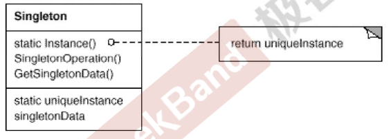

## 动机（Motivation）

* 在软件系统中，经常有这样一些特殊的类，必须保证它们在系统中只存在一个实例，才能确保它们的逻辑正确性、以及良好的效率。
* 如何绕过常规的构造器，提供一种机制来保证一个类只有一个实例?
* 这应该是类设计者的责任,而不是使用者的责任。

## 模式定义

保证一个类仅有一个实例，并提供一个该实例的全局访问点。

## 结构（Structure）



## 要点总结

- Singleton模式中的实例构造器可以设置为protected以允许子类派生。
- Singleton模式一般不要支持拷贝构造函数和Clone接口，因为这有可能导致多个对象实例，与Singleton模式的初衷违背。
- 如何实现多线程环境下安全的Singleton ?注意对双检查锁的正确实现。

## Code

```C++
// 懒汉模式
class singleClass
{
public:
    static singleClass* getinstance()
    {
		if (instance == nullptr)
        {
            i_mutex.lock();
            if (instance == nullptr)
            {
				instance = new singleClass();
            }
            i_mutex.unlock();
        }
        return instance;
    }
private:
    static singleClass* instance;
    static mutex i_mutex;
    singleClass(){};
};
singleClass* singleClass::instance = nullptr;
mutex singleClass::i_mutex;


// 饿汉模式
class singleClass
{
public:
    static singleClass* getinstance()
    {
        return instance;
    }
private:
    static singleClass* instance;
    singleClass(){};
};
singleClass* singleClass::instance = new singleClass;


```
