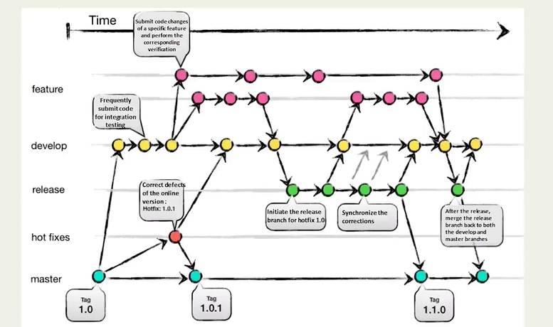

1. `git init`：初始化仓库
2. `git add <name>`：添加到暂存区
3. `git rm <name>`：取消跟踪
4. `git commit`：提交到本地工作区

5. `git reset head~ --soft`：取消本次提交（第一次提交不可取消）
6. `git status`：查看文件提交状态
7. `git diff`：查看文件的内容修改
8. `git log`：查看提交历史信息
9. `git log --pretty`：美化输出
10. `git log --gragh`：图形化输出
11. `git remote add origin URL`：添加远程仓库
12. `git remote rename oldname newname`：修改远程仓库名
13. `git push origin master`：推送；`-u`：只需输入一次仓库
    
14. `git branch --list`：查看分支
15. `git branch name`：创建name分支
16. `git checkout name`：切换到name分支
17. `git checout -b name`：创建name分支并切换
18. `git log --all`：查看所有分支log
19. `git merge name`：当前分支合并name分支
20. `git fetch`：拉取分支
21. `git checkout --track origin/name`：新建跟踪分支
22. `git stash == git stash push`：修改未提交，可以储藏当前分支，方便切换到其他分支，储藏后工作区干净。
23. `git stash apply`：恢复储藏
24. `git stash list`：查看历史
25. `git rebase`：切换到B分支，变基A分支，把B分支上的修改移动到A分支
26. `git rebase -i head~3`：选择前三次提交进行变基(修改)
