# 四、工作队列

操作系统为了支持多任务，实现了进程调度的功能，会把进程分为“运行”和“等待”等几种状态。

运行状态是进程获得CPU使用权，正在执行代码的状态;等待状态是阻塞状态，比如上述程序运行到recv时，程序会从运行状态变为等待状态，接收到数据后又变回运行状态。

操作系统会分时执行各个运行状态的进程，由于速度很快，看上去就像是同时执行多个任务。

下图的计算机中运行着 A、B 与 C 三个进程，其中进程 A 执行着上述基础网络程序，一开始，这 3 个进程都被操作系统的工作队列所引用，处于运行状态，会分时执行。

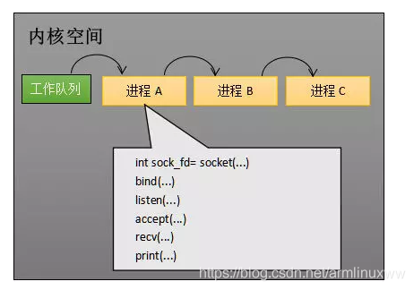

# 五、等待队列

当进程 A 执行到创建socket的语句时，操作系统会创建一个由文件系统管理的socket对象（如下图）。

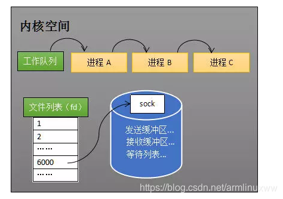

这个socket对象包含了发送缓冲区、接收缓冲区与等待队列等成员。等待队列是个非常重要的结构，它指向所有需要等待该socket事件的进程。

当程序执行到recv时，操作系统会将进程 A 从工作队列移动到该socket的等待队列中（如下图）。

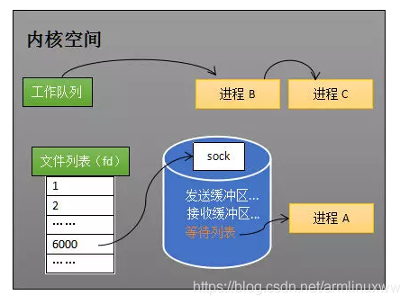

由于工作队列只剩下了进程 B 和 C，依据进程调度，CPU会轮流执行这两个进程的程序，不会执行进程 A 的程序。所以进程 A 被阻塞，不会往下执行代码，也不会占用CPU资源。

注：操作系统添加等待队列只是添加了对这个“等待中”进程的引用，以便在接收到数据时获取进程对象、将其唤醒，而非直接将进程管理纳入自己之下。上图为了方便说明，直接将进程挂到等待队列之下。

# 六、唤醒进程

当socket接收到数据后，操作系统将该socket等待队列上的进程重新放回到工作队列，该进程变成运行状态，继续执行代码。

同时由于socket的接收缓冲区已经有了数据，recv可以返回接收到的数据。

# 七、内核接收网络数据全过程

这一步，贯穿网卡、中断与进程调度的知识，叙述阻塞recv下内核接收数据的全过程。

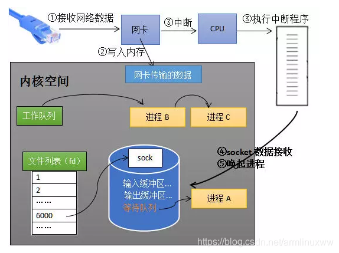

如上图所示，进程在recv阻塞期间：

* 计算机收到了对端传送的数据（步骤①）
* 数据经由网卡传送到内存（步骤②）
* 然后网卡通过中断信号通知CPU有数据到达，CPU执行中断程序（步骤 ③）

此处的中断程序主要有两项功能，先将网络数据写入到对应socket的接收缓冲区里面（步骤 ④），再唤醒进程 A（步骤 ⑤），重新将进程 A 放入工作队列中。

唤醒进程的过程如下图所示：

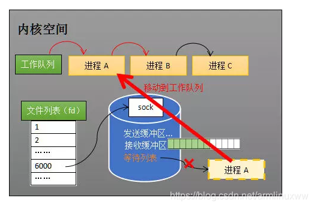

以上是内核接收数据全过程，这里我们可能会思考两个问题：

* 操作系统如何知道网络数据对应于哪个socket？
* 如何同时监视多个socket的数据？

第一个问题：因为一个socket对应着一个端口号，而网络数据包中包含了 IP 和端口的信息，内核可以通过端口号找到对应的socket。

当然，为了提高处理速度，操作系统会维护端口号到socket的索引结构，以快速读取。

第二个问题是多路复用的重中之重，也正是本文后半部分的重点。

# 九、select的流程

select 的实现思路很直接，假如程序同时监视如下图的sock1、sock2 和 sock3 三个socket，那么在调用select 之后，操作系统把进程A分别加入这三个socket的等待队列中。

当任何一个socket收到数据后，中断程序将唤起进程。下图展示了sock2 接收到了数据的处理流程：

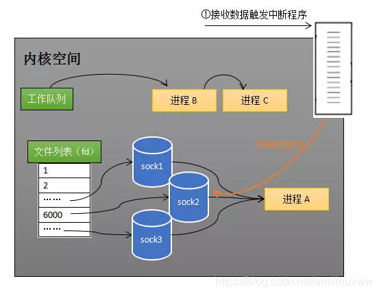

注：recv和 relect 的中断回调可以设置成不同的内容。

所谓唤起进程，就是将进程从所有的等待队列中移除，加入到工作队列里面，如下图所示：

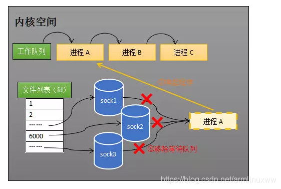

经由这些步骤，当进程A被唤醒后，它知道至少有一个socket接收了数据。程序只需遍历一遍socket列表，就可以得到就绪的socket。

这种简单方式行之有效，在几乎所有操作系统都有对应的实现。但是简单的方法往往有缺点，主要是：

* 每次调用select都需要将进程加入到所有监视socket的等待队列，每次唤醒都需要从每个队列中移除。这里涉及了两次遍历，而且每次都要将整个 FDS 列表传递给内核，有一定的开销。

正是因为遍历操作开销大，出于效率的考量，才会规定select 的最大监视数量，默认只能监视1024个socket。

* 进程被唤醒后，程序并不知道哪些socket收到数据，还需要遍历一次。

那么，有没有减少遍历的方法？有没有保存就绪socket的方法？这两个问题便是epoll技术要解决的。

补充说明：本节只解释了select 的一种情形。当程序调用select 时，内核会先遍历一遍socket，如果有一个以上的socket接收缓冲区有数据，那么select 直接返回，不会阻塞。

这也是为什么select 的返回值有可能大于1的原因之一。如果没有socket有数据，进程才会阻塞。

# 十、epoll的设计思路

epoll是在select 出现 N 多年后才被发明的，是select 和 poll（poll 和 select 基本一样，有少量改进）的增强版本。epoll通过以下一些措施来改进效率：

## 1、措施一：功能分离

select 低效的原因之一是将“维护等待队列”和“阻塞进程”两个步骤合二为一。

如上图所示，每次调用select都需要这两步操作，然而大多数应用场景中，需要监视的socket相对固定，并不需要每次都修改。

epoll将这两个操作分开，先用epoll_ctl 维护等待队列，再调用epoll_wait 阻塞进程。显而易见地，效率就能得到提升。

## 2、措施二：就绪列表

select低效的另一个原因在于程序不知道哪些socket收到数据，只能一个个遍历。如果内核维护一个“就绪列表”，引用收到数据的socket，就能避免遍历。

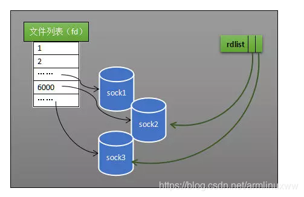

如上图所示，计算机共有三个socket，收到数据的sock2和sock3 被就绪列表rdlist所引用。

当进程被唤醒后，只要获取rdlist 的内容，就能够知道哪些socket收到数据。

# 十一、epoll的原理与工作流程

本节会以示例和图表来讲解epoll的原理和工作流程。

## 1、创建epoll对象

如下图所示，当某个进程调用epoll_create
方法时，内核会创建一个 eventpoll 对象（也就是程序中 epfd 所代表的对象）。

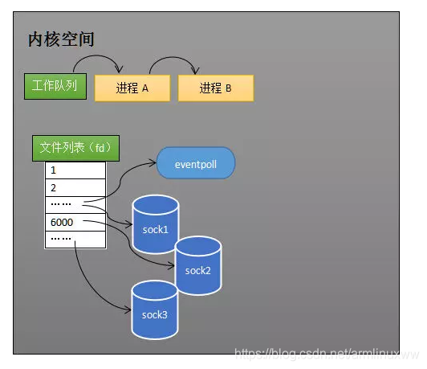

eventpoll 对象也是文件系统中的一员，和socket一样，它也会有等待队列。

创建一个代表该epoll的 eventpoll 对象是必须的，因为内核要维护“就绪列表”等数据，“就绪列表”可以作为 eventpoll 的成员。

## 2、维护监视列表

创建epoll对象后，可以用epoll_ctl 添加或删除所要监听的socket。以添加socket为例。

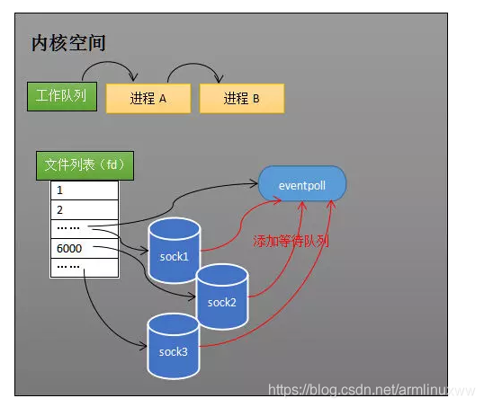

如上图，如果通过epoll_ctl 添加sock1、sock2 和sock3 的监视，内核会将 eventpoll 添加到这三个socket的等待队列中。

当socket收到数据后，中断程序会操作 eventpoll 对象，而不是直接操作进程。

## 3、接收数据

当socket收到数据后，中断程序会给 eventpoll 的“就绪列表”添加socket引用。

如上图展示的是sock2 和sock3 收到数据后，中断程序让rdlist 引用这两个socket。

eventpoll 对象相当于socket和进程之间的中介，socket的数据接收并不直接影响进程，而是通过改变eventpoll 的就绪列表来改变进程状态。

当程序执行到epoll_wait 时，如果rdlist 已经引用了socket，那么epoll_wait 直接返回，如果 rdlist 为空，阻塞进程。

## 4、阻塞和唤醒进程

假设计算机中正在运行进程 A 和进程 B，在某时刻进程 A 运行到了epoll_wait语句。

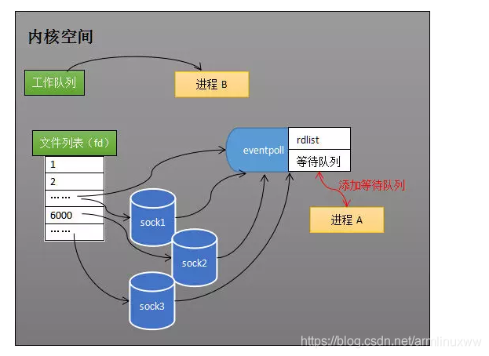

如上图所示，内核会将进程 A 放入 eventpoll 的等待队列中，阻塞进程。

当socket接收到数据，中断程序一方面修改rdlist，另一方面唤醒 eventpoll 等待队列中的进程，进程 A 再次进入运行状态（如下图）。

也因为rdlist 的存在，进程 A 可以知道哪些socket发生了变化。

# 十二、epoll的实现细节

至此，相信读者对epoll的本质已经有一定的了解。但我们还需要知道 eventpoll 的数据结构是什么样子？

此外，就绪队列应该使用什么数据结构？eventpoll应使用什么数据结构来管理通过epoll_ctl 添加或删除的socket？

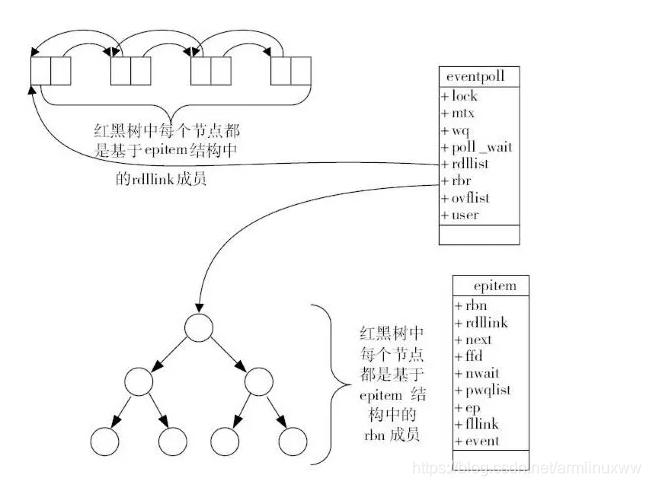

如上图所示，eventpoll 包含了 Lock、MTX、WQ（等待队列）与 rdlist 等成员，其中rdlist 和 RBR 是我们所关心的。

## 1、就绪列表的数据结构

就绪列表引用着就绪的socket，所以它应能够快速的插入数据。程序可能随时调用epoll_ctl 添加监视socket，也可能随时删除。

当删除时，若该socket已经存放在就绪列表中，它也应该被移除。所以就绪列表应是一种能够快速插入和删除的数据结构。

双向链表就是这样一种数据结构，epoll使用双向链表来实现就绪队列（对应上图的rdlist）。

## 2、索引结构

既然epoll将“维护监视队列”和“进程阻塞”分离，也意味着需要有个数据结构来保存监视的socket，至少要方便地添加和移除，还要便于搜索，以避免重复添加。

红黑树是一种自平衡二叉查找树，搜索、插入和删除时间复杂度都是 O（log2(N)=log(N)），效率较好，epoll使用了红黑树作为索引结构（对应上图的 RBR）。

注：因为操作系统要兼顾多种功能，以及有更多需要保存的数据，rdlist 并非直接引用socket，而是通过 epitem 间接引用，红黑树的节点也是 epitem 对象。

同样，文件系统也并非直接引用着socket。为方便理解，本文中省略了一些间接结构。

# 附、水平触发与边缘触发的性能差异

平时大家使用 epoll 时都知道其事件触发模式有默认的 level-trigger 模式和通过 EPOLLET 启用的 edge-trigger 模式两种。从 epoll 发展历史来看，它刚诞生时只有 edge-trigger 模式，后来因容易产生 race-cond 且不易被开发者理解，又增加了 level-trigger 模式并作为默认处理方式。

二者的差异在于
level-trigger 模式下只要某个 fd 处于readable/writable 状态，无论什么时候进行 epoll_wait 都会返回该 fd；而 edge-trigger 模式下只有某个 fd 从 unreadable 变为 readable 或从 unwritable 变为 writable 时，epoll_wait 才会返回该 fd。

通常的误区是：level-trigger模式在 epoll 池中存在大量 fd 时效率要显著低于 edge-trigger 模式。

但从 kernel 代码来看，edge-trigger/level-trigger 模式的处理逻辑几乎完全相同，差别仅在于 level-trigger 模式在 event 发生时不会将其从 ready list 中移除，略为增大了 event 处理过程中 kernel space 中记录数据的大小。

然而，edge-trigger 模式一定要配合 user app 中的 ready list 结构，以便收集已出现 event 的 fd，再通过round-robin 方式挨个处理，以此避免通信数据量很大时出现忙于处理热点 fd 而导致非热点 fd 饿死的现象。统观 kernel 和 user space，由于 user app 中 ready list 的实现千奇百怪，不一定都经过仔细的推敲优化，因此edge-trigger 的总内存开销往往还大于 level-trigger 的开销。

一般号称 edge-trigger 模式的优势在于能够减少 epoll 相关系统调用，这话不假，但 user app 里可不是只有 epoll 相关系统调用吧？为了绕过饿死问题，edge-trigger 模式的 user app 要自行进行 read/write 循环处理，这其中增加的系统调用和减少的 epoll 系统调用加起来，有谁能说一定就能明显地快起来呢？

实际上，epoll_wait 的效率是 O(ready fd num) 级别的，因此 edge-trigger 模式的真正优势在于减少了每次 epoll_wait 可能需要返回的 fd 数量，在并发 event 数量极多的情况下能加快 epoll_wait 的处理速度，但别忘了这只是针对 epoll 体系自己而言的提升，与此同时 user app 需要增加复杂的逻辑、花费更多的 cpu/mem 与其配合工作，总体性能收益究竟如何？只有实际测量才知道，无法一概而论。不过，为了降低处理逻辑复杂度，常用的事件处理库大部分都选择了 level-trigger 模式（如 libevent、boost::asio等）

**结论：**

* epoll 的 edge-trigger 和 level-trigger 模式处理逻辑差异极小，性能测试结果表明常规应用场景中二者性能差异可以忽略。
* 使用 edge-trigger 的 user app 比使用 level-trigger 的逻辑复杂，出错概率更高。
* edge-trigger 和 level-trigger 的性能差异主要在于 epoll_wait 系统调用的处理速度，是否是 user app 的性能瓶颈需要视应用场景而定，不可一概而论
