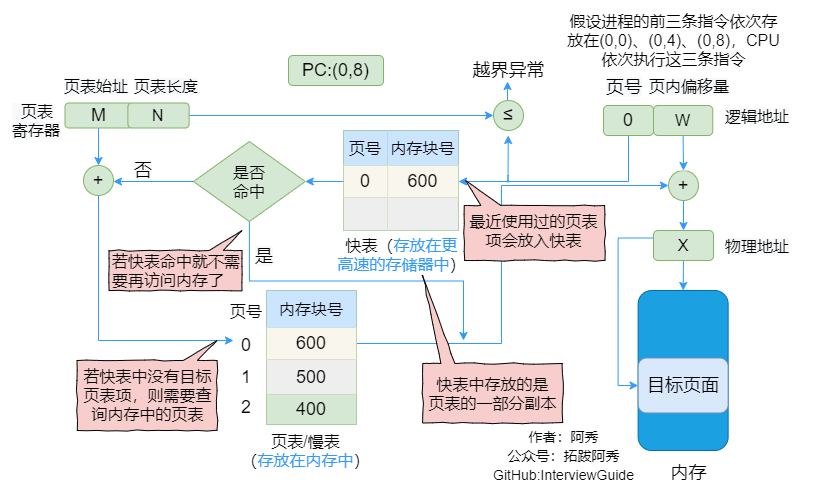
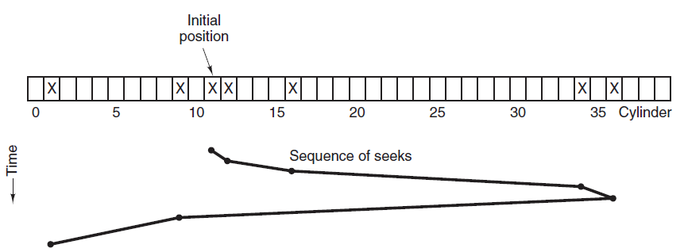

# Linux命令

## 1、Linux中查看进程运行状态的指令、查看内存使用情况的指令、tar解压文件的参数。

1. **查看进程运行状态的指令**：ps命令。“**ps -aux | grep PID**”，用来查看某PID进程状态
2. **查看内存使用情况的指令**：free命令。“**free -m**”，命令查看内存使用情况, 包括实体内存，虚拟的交换文件内存，共享内存区段，以及系统核心使用的缓冲区等。
```
-b 　以Byte为单位显示内存使用情况。
-k 　以KB为单位显示内存使用情况。
-m 　以MB为单位显示内存使用情况。
-h 　以合适的单位显示内存使用情况，最大为三位数，自动计算对应的单位值。单位有：
        B = bytes
        K = kilos
        M = megas
        G = gigas
        T = teras
-o 　不显示缓冲区调节列。
-s<间隔秒数> 　持续观察内存使用状况。
-t 　显示内存总和列。
-V 　显示版本信息。
```
3. **tar解压文件的参数**：
   ```shell
   五个命令中必选一个      
   -c: 建立压缩档案      
   -x：解压      
   -t：查看内容      
   -r：向压缩归档文件末尾追加文件      
   -u：更新原压缩包中的文件 这几个参数是可选的      
   -z：有gzip属性的      
   -j：有bz2属性的      
   -Z：有compress属性的      
   -v：显示所有过程      
   -O：将文件解开到标准输出
   ```

```
//ps使用示例 
//显示当前所有进程   ps -A   
//与grep联用查找某进程   ps -aux | grep apache    
//查看进程运行状态、查看内存使用情况的指令均可使用top指令。 top
```

## 2、文件权限怎么修改

Linux文件的基本权限就有九个，分别是owner/group/others三种身份各有自己的read/write/execute权限

修改权限指令：**chmod**

举例：文件的权限字符为 -rwxrwxrwx 时，这九个权限是三个三个一组。其中，我们可以使用数字来代表各个权限。

各权限的分数对照如下：

| r | w | x |
| - | - | - |
| 4 | 2 | 1 |

每种身份(owner/group/others)各自的三个权限(r/w/x)分数是需要累加的，

例如当权限为： [-rwxrwx---] ，则分数是：

owner = rwx = 4+2+1 = 7

group = rwx = 4+2+1 = 7

others= --- = 0+0+0 = 0

所以我们设定权限的变更时，该文件的权限数字就是770！变更权限的指令chmod的语法是这样的：

```
[root@www ~]# chmod [-R] xyz 文件或目录  
选项与参数：  
xyz : 就是刚刚提到的数字类型的权限属性，为 rwx 属性数值的相加。  
-R : 进行递归(recursive)的持续变更，亦即连同次目录下的所有文件都会变更      
# chmod 770 test.c //即修改test.c文件的权限为770
```

## 3、说说常用的Linux命令

1. cd命令：用于切换当前目录
2. ls命令：查看当前文件与目录
3. grep命令：该命令常用于分析一行的信息，若当中有我们所需要的信息，就将该行显示出来，该命令通常与管道命令一起使用，用于对一些命令的输出进行筛选加工。
4. cp命令：复制命令
5. mv命令：移动文件或文件夹命令
6. rm命令：删除文件或文件夹命令
7. ps命令：查看进程情况
8. kill命令：向进程发送终止信号
9. tar命令：对文件进行打包，调用gzip或bzip对文件进行压缩或解压
10. cat命令：查看文件内容，与less、more功能相似
11. top命令：可以查看操作系统的信息，如进程、CPU占用率、内存信息等
12. pwd命令：命令用于显示工作目录。
13. netstat：查询连接数

## 4、Linux修改主机名的命令是什么？
`sudo hostnamectl set-hostname myDebian #myDebian为修改名`

## 5、Linux开机自动执行命令如何实现？
使用 /etc/rc.d/rc.local

`chmod +x /etc/rc.d/rc.local`

然后在这个文件底部添加脚本。

</br>
</br>
</br>

# 内存管理
## 7、操作系统如何申请以及管理内存的？

从操作系统角度来看，进程分配内存有两种方式，分别由两个系统调用完成：**brk和mmap**

## 8、简述操作系统中malloc的实现原理

malloc底层实现：当开辟的空间小于 128K 时，调用 brk（）函数；当开辟的空间大于 128K 时，调用mmap（）。malloc采用的是内存池的管理方式，以减少内存碎片。先申请大块内存作为堆区，然后将堆区分为多个内存块。当用户申请内存时，直接从堆区分配一块合适的空闲快。采用隐式链表将所有空闲块，每一个空闲块记录了一个未分配的、连续的内存地址。

## 11、简述LRU算法及其实现方式。

1. **LRU算法**：LRU算法用于缓存淘汰。思路是将缓存中最近最少使用的对象删除掉
2. **实现方式**：利用**链表和hashmap**。
   当需要插入新的数据项的时候，如果新数据项在链表中存在（一般称为命中），则把该节点移到链表头部，如果不存在，则新建一个节点，放到链表头部，若缓存满了，则把链表最后一个节点删除即可。
   在访问数据的时候，如果数据项在链表中存在，则把该节点移到链表头部，否则返回-1。这样一来在链表尾部的节点就是最近最久未访问的数据项。

给出C++实现的代码

```C++
class LRUCache {
    list<pair<int, int>> cache;//创建双向链表
    unordered_map<int, list<pair<int, int>>::iterator> map;//创建哈希表
    int cap;
public:
    LRUCache(int capacity) {
        cap = capacity;
    }
  
    int get(int key) {
        if (map.count(key) > 0){
            auto temp = *map[key];
            cache.erase(map[key]);
            map.erase(key);
            cache.push_front(temp);
            map[key] = cache.begin();//映射头部
            return temp.second;
        }
        return -1;
    }
  
    void put(int key, int value) {
        if (map.count(key) > 0){
            cache.erase(map[key]);
            map.erase(key);
        }
        else if (cap == cache.size()){
            auto temp = cache.back();
            map.erase(temp.first);
            cache.pop_back();
        }
        cache.push_front(pair<int, int>(key, value));
        map[key] = cache.begin();//映射头部
    }
};

/**
 * Your LRUCache object will be instantiated and called as such:
 * LRUCache* obj = new LRUCache(capacity);
 * int param_1 = obj->get(key);
 * obj->put(key,value);
 */
```

## 27、简述mmap的原理和使用场景

**原理**：**mmap是一种内存映射文件的方法**，即将一个文件或者其它对象映射到进程的地址空间，实现文件磁盘地址和进程虚拟地址空间中一段虚拟地址的一一对映关系。实现这样的映射关系后，进程就可以采用指针的方式读写操作这一段内存，而系统会自动回写脏页面到对应的文件磁盘上，即完成了对文件的操作而不必再调用read, write等系统调用函数。相反，内核空间对这段区域的修改也直接反映用户空间，从而可以实现不同进程间的文件共享。如下图：


**使用场景**：

1. 对同一块区域频繁读写操作；
2. 可用于实现用户空间和内核空间的高效交互
3. 可提供进程间共享内存及相互通信
4. 可实现高效的大规模数据传输。

## 36、什么是缓冲区溢出？有什么危害？

缓冲区为暂时置放输出或输入资料的内存。缓冲区溢出是指当计算机向缓冲区填充数据时超出了缓冲区本身的容量，溢出的数据覆盖在合法数据上。造成缓冲区溢出的主要原因是程序中没有仔细检查用户输入是否合理。计算机中，缓冲区溢出会造成的危害主要有以下两点：程序崩溃导致拒绝服务和跳转并且执行一段恶意代码。

## 37、说说堆栈溢出是什么，会怎么样？

堆栈溢出就是不顾堆栈中分配的局部数据块大小，向该数据块写入了过多的数据，导致数据越界。常指调用堆栈溢出，本质上一种数据结构的满溢情况。堆栈溢出可以理解为两个方面：**堆溢出和栈溢出。**

1. 堆溢出：比如不断的new 一个对象，一直创建新的对象，而不进行释放，最终导致内存不足。将会报错：OutOfMemory Error。
2. 栈溢出：一次函数调用中，栈中将被依次压入：参数，返回地址等，而方法如果递归比较深或进去死循环，就会导致栈溢出。将会报错：StackOverflow Error。

## 38、什么是页表，为什么要有？

页表是虚拟内存的概念。**操作系统虚拟内存到物理内存的映射表，就被称为页表。**

**原因**：不可能每一个虚拟内存的 Byte 都对应到物理内存的地址。这张表将大得真正的物理地址也放不下，于是操作系统引入了页（Page）的概念。进行分页，这样可以减小虚拟内存页对应物理内存页的映射表大小。

**答案解析**

如果将每一个虚拟内存的 Byte 都对应到物理内存的地址，每个条目最少需要 8字节（32位虚拟地址->32位物理地址），在 4G 内存的情况下，就需要 32GB 的空间来存放对照表，那么这张表就大得真正的物理地址也放不下了，于是操作系统引入了页（Page）的概念。

在系统启动时，操作系统将整个物理内存以 4K 为单位，划分为各个页。之后进行内存分配时，都以页为单位，那么虚拟内存页对应物理内存页的映射表就大大减小了，4G 内存，只需要 8M 的映射表即可，一些进程没有使用到的虚拟内存，也并不需要保存映射关系，而且Linux 还为大内存设计了多级页表，可以进一页减少了内存消耗。

## 39、简述操作系统中的缺页中断。

1. **缺页异常**：malloc和mmap函数在分配内存时只是建立了进程虚拟地址空间，并没有分配虚拟内存对应的物理内存。当进程访问这些没有建立映射关系的虚拟内存时，处理器自动触发一个**缺页异常，引发缺页中断**。
2. **缺页中断**：缺页异常后将产生一个缺页中断，此时操作系统会根据页表中的**外存地址**在外存中找到所缺的一页，将其调入**内存**。

**答案解析**

两者区别。

缺页中断与一般中断一样，需要经历四个步骤：保护CPU现场、分析中断原因、转入缺页中断处理程序、恢复CPU现场，继续执行。 缺页中断与一般中断区别： （1）在指令执行期间产生和处理缺页中断信号 （2）一条指令在执行期间，可能产生多次缺页中断 （3）缺页中断返回的是执行产生中断的一条指令，而一般中断返回的是执行下一条指令。

## 40、分页与分段的区别？

1. 段是信息的逻辑单位，它是根据用户的需要划分的，因此段对用户是可见的 ；页是信息的物理单位，是为了管理主存的方便而划分的，对用户是透明的；
2. 段的大小不固定，有它所完成的功能决定；页大大小固定，由系统决定；
3. 段向用户提供二维地址空间；页向用户提供的是一维地址空间；分页标示一个地址只需要一个助记符所以是一维的，分段标示一个地址需要段号和段内地址所以是二维的
4. 段是信息的逻辑单位，便于存储保护和信息的共享，页的保护和共享受到限制。
5. 页有内部碎片无外部碎片，段有外部碎片无内部碎片

## 41、物理地址、逻辑地址、虚拟内存的概念

1. 物理地址：它是地址转换的最终地址，进程在运行时执行指令和访问数据最后都要通过物理地址从主存中存取，是内存单元真正的地址。
2. 逻辑地址：是指计算机用户看到的地址。例如：当创建一个长度为 100 的整型数组时，操作系统返回一个逻辑上的连续空间：指针指向数组第一个元素的内存地址。由于整型元素的大小为 4 个字节，故第二个元素的地址时起始地址加 4，以此类推。事实上，逻辑地址并不一定是元素存储的真实地址，即数组元素的物理地址（在内存条中所处的位置），并非是连续的，只是操作系统通过地址映射，将逻辑地址映射成连续的，这样更符合人们的直观思维。
3. 虚拟内存：是计算机系统内存管理的一种技术。它使得应用程序认为它拥有连续的可用的内存（一个连续完整的地址空间），而实际上，它通常是被分隔成多个物理内存碎片，还有部分暂时存储在外部磁盘存储器上，在需要时进行数据交换。
4. **为什么要用虚拟内存**：因为早期的内存分配方法存在以下问题：
   （1）进程地址空间不隔离。会导致数据被随意修改。
   （2）内存使用效率低。
   （3）程序运行的地址不确定。操作系统随机为进程分配内存空间，所以程序运行的地址是不确定的。
5. **使用虚拟内存的好处**：
   （1）扩大地址空间。每个进程独占一个4G空间，虽然真实物理内存没那么多。
   （2）内存保护：防止不同进程对物理内存的争夺和践踏，可以对特定内存地址提供写保护，防止恶意篡改。
   （3）可以实现内存共享，方便进程通信。
   （4）可以避免内存碎片，虽然物理内存可能不连续，但映射到虚拟内存上可以连续。
6. **使用虚拟内存的缺点**：
   （1）虚拟内存需要额外构建数据结构，占用空间。
   （2）虚拟地址到物理地址的转换，增加了执行时间。
   （3）页面换入换出耗时。
   （4）一页如果只有一部分数据，浪费内存。

## 42、虚拟地址到物理地址怎么映射的？

**参考回答**

操作系统为每一个进程维护了一个从虚拟地址到物理地址的映射关系的数据结构，叫页表。页表中的每一项都记录了这个页的基地址。

**三级页表转换方法：（两步）**

1. 逻辑地址转线性地址：段起始地址+段内偏移地址=线性地址
2. 线性地址转物理地址：
   （1）每一个32位的线性地址被划分为三部分：页目录索引（DIRECTORY，10位）、页表索引（TABLE，10位）、页内偏移（OFFSET，12位） （2）从**cr3**中取出进程的页目录地址（操作系统调用进程时，这个地址被装入寄存器中）         页目录地址 + 页目录索引 = 页表地址         页表地址 + 页表索引 = 页地址         页地址 + 页内偏移 = 物理地址
3. 一个三级页表从虚拟地址到物理地址的转换。


## 43、页面置换算法有哪些？

请求调页，也称按需调页，即对不在内存中的“页”，当进程执行时要用时才调入，否则有可能到程序结束时也不会调入。而内存中给页面留的位置是有限的，在内存中以帧为单位放置页面。为了防止请求调页的过程出现过多的内存页面错误（即需要的页面当前不在内存中，需要从硬盘中读数据，也即需要做页面的替换）而使得程序执行效率下降，我们需要设计一些页面置换算法，页面按照这些算法进行相互替换时，可以尽量达到较低的错误率。常用的页面置换算法如下：

- **先进先出置换算法（FIFO）**

先进先出，即淘汰最早调入的页面。

- **最佳置换算法（OPT）**

选未来最远将使用的页淘汰，是一种最优的方案，可以证明缺页数最小。

- **最近最久未使用（LRU）算法**

即选择最近最久未使用的页面予以淘汰

- **时钟（Clock）置换算法**

时钟置换算法也叫最近未用算法 NRU（Not RecentlyUsed）。该算法为每个页面设置一位访问位，将内存中的所有页面都通过链接指针链成一个循环队列。

|                         | 算法规则                                                                                                                                | 优缺点                                          |
| ----------------------- | --------------------------------------------------------------------------------------------------------------------------------------- | ----------------------------------------------- |
| OPT                     | 优先淘汰最长时间内不会被访问的页面                                                                                                      | 缺页率最小，性能最好;但无法实现                 |
| FIFO                    | 优先淘汰最先进入内存的页面                                                                                                              | 实现简单;但性能很差，可能出现Belady异常         |
| LRU                     | 优先淘汰最近最久没访问的页面                                                                                                            | 性能很好;但需要硬件支持，算法开销大             |
| CLOCK (NRU)             | 循环扫描各页面 第一轮淘汰访问位=0的，并将扫描过的页面访问位改为1。若第-轮没选中，则进行第二轮扫描。                                     | 实现简单，算法开销小;但未考虑页面是否被修改过。 |
| 改进型CLOCK (改进型NRU) | 若用(访问位，修改位)的形式表述，则 第一轮:淘汰(0,0) 第二轮:淘汰(O,1)，并将扫描过的页面访问位都置为0 第三轮:淘汰(O, 0) 第四轮:淘汰(0, 1) | 算法开销较小，性能也不错                        |

## 48、内存的覆盖是什么？有什么特点？

由于程序运行时并非任何时候都要访问程序及数据的各个部分（尤其是大程序），因此可以把用户空间分成为一个固定区和若干个覆盖区。将经常活跃的部分放在固定区，其余部分按照调用关系分段，首先将那些即将要访问的段放入覆盖区，其他段放在外存中，在需要调用前，系统将其调入覆盖区，替换覆盖区中原有的段。

覆盖技术的特点：是打破了必须将一个进程的全部信息装入内存后才能运行的限制，但当同时运行程序的代码量大于主存时仍不能运行，再而，大家要注意到，内存中能够更新的地方只有覆盖区的段，不在覆盖区的段会常驻内存。

## 49、内存交换是什么？有什么特点？

 **交换(对换)技术的设计思想** ：内存空间紧张时，系统将内存中某些进程暂时换出外存，把外存中某些已具备运行条件的进程换入内存(进程在内存与磁盘间动态调度)

换入：把准备好竞争CPU运行的程序从辅存移到内存。 换出：把处于等待状态（或CPU调度原则下被剥夺运行权力）的程序从内存移到辅存，把内存空间腾出来。

## 50、什么时候会进行内存的交换？

内存交换通常在许多进程运行且内存吃紧时进行，而系统负荷降低就暂停。例如:在发现许多进程运行时经常发生缺页，就说明内存紧张，此时可以换出一些进程;如果缺页率明显下降，就可以暂停换出。

## 53、什么是快表，你知道多少关于快表的知识

快表，又称联想寄存器(TLB) ，是一种访问速度比内存快很多的高速缓冲存储器，用来存放当前访问的若干页表项，以加速地址变换的过程。与此对应，内存中的页表常称为慢表。



## 54、地址变换中，有快表和没快表，有什么区别？

|                        | 地址变换过程                                                                                                                                                                                                                           | 访问一个逻辑地址的访存次数                      |
| ---------------------- | -------------------------------------------------------------------------------------------------------------------------------------------------------------------------------------------------------------------------------------- | ----------------------------------------------- |
| 基本地址变换机构       | ①算页号、页内偏移量 ②检查页号合法性 ③查页表，找到页面存放的内存块号 ④根据内存块号与页内偏移量得到物理地址 ⑤访问目标内存单元                                                                                                       | 两次访存                                        |
| 具有快表的地址变换机构 | ①算页号、页内偏移量 ②检查页号合法性 ③查快表。若命中，即可知道页面存放的内存块号，可直接进行⑤;若未命中则进行④ ④查页表，找到页面存放的内存块号，并且将页表项复制到快表中 ⑤根据内存块号与页内偏移量得到物理地址 ⑥访问目标内存单元 | 快表命中，只需一次访存 快表未命中，需要两次访存 |

## 55、为什么分段式存储管理有外部碎片而无内部碎片？为什么固定分区分配有内部碎片而不会有外部碎片？

分段式分配是按需分配，而固定式分配是固定分配的方式。

## 56、内部碎片与外部碎片

内碎片：分配给某些进程的内存区域中有些部分没用上，常见于固定分配方式

内存总量相同，100M

固定分配，将100M分割成10块，每块10M，一个程序需要45M，那么需要分配5块，第五块只用了5M，剩下的5M就是内部碎片；

分段式分配，按需分配，一个程序需要45M，就给分片45MB，剩下的55M供其它程序使用，不存在内部碎片。

外碎片：内存中某些空闲区因为比较小，而难以利用上，一般出现在内存动态分配方式中

分段式分配：内存总量相同，100M，比如，内存分配依次5M，15M，50M，25M，程序运行一段时间之后，5M，15M的程序运行完毕，释放内存，其他程序还在运行，再次分配一个10M的内存供其它程序使用，只能从头开始分片，这样，就会存在10M+5M的外部碎片

## 57、如何消除碎片文件

对于外部碎片，通过**紧凑技术**消除，就是操作系统不时地对进程进行移动和整理。但是这需要动态重定位寄存器地支持，且相对费时。紧凑地过程实际上类似于Windows系统中地磁盘整理程序，只不过后者是对外存空间地紧凑

解决外部内存碎片的问题就是 **内存交换** 。

可以把音乐程序占用的那 256MB 内存写到硬盘上，然后再从硬盘上读回来到内存里。不过再读回的时候，我们不能装载回原来的位置，而是紧紧跟着那已经被占用了的 512MB 内存后面。这样就能空缺出连续的 256MB 空间，于是新的 200MB 程序就可以装载进来。

回收内存时要尽可能地将相邻的空闲空间合并。

## 58、冯诺依曼结构有哪几个模块？分别对应现代计算机的哪几个部分？（百度安全一面）

* 存储器：内存
* 控制器：南桥北桥
* 运算器：CPU
* 输入设备：键盘
* 输出设备：显示器、网卡

## 59、局部性原理你知道吗？主要有哪两大局部性原理？各自是什么？

主要分为 **时间局部性和空间局部性** 。

时间局部性:如果执行了程序中的某条指令，那么不久后这条指令很有可能再次执行;如果某个数据被访问过，不久之后该数据很可能再次被访问。(因为程序中存在大量的循环) 空间局部性:一旦程序访问了某个存储单元，在不久之后，其附近的存储单元也很有可能被访问。(因为很多数据在内存中都是连续存放的，并且程序的指令也是顺序地在内存中存放的)

## 60、内存交换中，被换出的进程保存在哪里？

保存在磁盘中，也就是外存中。具有对换功能的操作系统中，通常把磁盘空间分为文件区和对换区两部分。文件区主要用于存放文件，主要追求存储空间的利用率，因此对文件区空间的管理采用离散分配方式;对换区空间只占磁盘空间的小部分，被换出的进程数据就存放在对换区。由于对换的速度直接影响到系统的整体速度，因此对换区空间的管理主要追求换入换出速度，因此通常对换区采用连续分配方式(学过文件管理章节后即可理解)。总之，对换区的I/O速度比文件区的更快。

## 61、内存交换和覆盖有什么区别？

交换技术主要是在不同进程（或作业）之间进行，而覆盖则用于同一程序或进程中。

## 62、内存交换你知道有哪些需要注意的关键点吗？

1. 交换需要备份存储，通常是快速磁盘，它必须足够大，并且提供对这些内存映像的直接访问。
2. 为了有效使用CPU，需要每个进程的执行时间比交换时间长，而影响交换时间的主要是转移时间，转移时间与所交换的空间内存成正比。
3. 如果换出进程，比如确保该进程的内存空间成正比。
4. 交换空间通常作为磁盘的一整块，且独立于文件系统，因此使用就可能很快。
5. 交换通常在有许多进程运行且内存空间吃紧时开始启动，而系统负荷降低就暂停。
6. 普通交换使用不多，但交换的策略的某些变种在许多系统中（如UNIX系统）仍然发挥作用

## 63、动态分区分配算法有哪几种？可以分别说说吗？

首次适应不仅最简单，通常也是最好最快，不过首次适应算法会使得内存低地址部分出现很多小的空闲分区，而每次查找都要经过这些分区，因此也增加了查找的开销。邻近算法试图解决这个问题，但实际上，它常常会导致在内存的末尾分配空间分裂成小的碎片，它通常比首次适应算法结果要差。

最佳导致大量碎片，最坏导致没有大的空间。

进过实验，首次适应比最佳适应要好，他们都比最坏好。

| 算法     | 算法思想                                           | 分区排列顺序                                 | 优点                                                                               | 缺点                                                                                             |
| -------- | -------------------------------------------------- | -------------------------------------------- | ---------------------------------------------------------------------------------- | ------------------------------------------------------------------------------------------------ |
| 首次适应 | 从头到尾找适合的分区                               | 空闲分区以地址递增次序排列                   | 综合看性能最好。**算法开销小** ，回收分区后一.般不需要对空闲分区队列重新排序 |                                                                                                  |
| 最佳适应 | 优先使用更小的分区，以保留更多大分区               | 空闲分区以容量递增次序排列                   | 会有更多的大分区被保留下来，更能满足大进程需求                                     | 会产生很多太小的、难以利用的碎片;**算法开销大** ，回收分区后可能需要对空闲分区队列重新排序 |
| 最坏适应 | 优先使用更大的分区，以防止产生太小的不可用的碎片   | 空闲分区以容量递减次序排列                   | 可以减少难以利用的小碎片                                                           | 大分区容易被用完，不利于大进程;**算法开销大** (原因同上)                                   |
| 邻近适应 | 由首次适应演变而来，每次从上次查找结束位置开始查找 | 空闲分区以地址递增次序排列(可排列成循环链表) | 不用每次都从低地址的小分区开始检索。**算法开销小** (原因同首次适应算法)      | 会使高地址的大分区也被用完                                                                       |

## 64、原子操作的是如何实现的

处理器使用基于对缓存加锁或总线加锁的方式来实现多处理器之间的原子操作。首先处理器会自动保证基本的内存操作的原子性。处理器保证从系统内存中读取或者写入一个字节是原子的，意思是当一个处理器读取一个字节时，其他处理器不能访问这个字节的内存地址。Pentium 6和最新的处理器能自动保证单处理器对同一个缓存行里进行16/32/64位的操作是原子的，但是复杂的内存操作处理器是不能自动保证其原子性的，比如跨总线宽度、跨多个缓存行和跨页表的访问。但是，处理器提供总线锁定和缓存锁定两个机制来保证复杂内存操作的原子性。

（1）使用总线锁保证原子性 第一个机制是通过总线锁保证原子性。如果多个处理器同时对共享变量进行读改写操作（i++就是经典的读改写操作），那么共享变量就会被多个处理器同时进行操作，这样读改写操作就不是原子的，操作完之后共享变量的值会和期望的不一致。举个例子，如果i=1，我们进行两次i++操作，我们期望的结果是3，但是有可能结果是2，如图下图所示。

```C++
CPU1    CPU2
 i=1     i=1
 i+1     i+1
 i=2     i=2Copy to clipboardErrorCopied
```

原因可能是多个处理器同时从各自的缓存中读取变量i，分别进行加1操作，然后分别写入系统内存中。那么，想要保证读改写共享变量的操作是原子的，就必须保证CPU1读改写共享变量的时候，CPU2不能操作缓存了该共享变量内存地址的缓存。

处理器使用总线锁就是来解决这个问题的。**所谓总线锁就是使用处理器提供的一个LOCK＃信号，当一个处理器在总线上输出此信号时，其他处理器的请求将被阻塞住，那么该处理器可以独占共享内存。**

（2）使用缓存锁保证原子性 第二个机制是通过缓存锁定来保证原子性。在同一时刻，我们只需保证对某个内存地址的操作是原子性即可，但**总线锁定把CPU和内存之间的通信锁住了**，这使得锁定期间，其他处理器不能操作其他内存地址的数据，所以总线锁定的开销比较大，目前处理器在某些场合下使用缓存锁定代替总线锁定来进行优化。

频繁使用的内存会缓存在处理器的L1、L2和L3高速缓存里，那么原子操作就可以直接在处理器内部缓存中进行，并不需要声明总线锁，在Pentium 6和目前的处理器中可以使用“缓存锁定”的方式来实现复杂的原子性。

所谓“缓存锁定”是指内存区域如果被缓存在处理器的缓存行中，并且在Lock操作期间被锁定，那么当它执行锁操作回写到内存时，处理器不在总线上声言LOCK＃信号，而是修改内部的内存地址，并允许它的缓存一致性机制来保证操作的原子性，因为**缓存一致性机制会阻止同时修改由两个以上处理器缓存的内存区域数据，当其他处理器回写已被锁定的缓存行的数据时，会使缓存行无效，在如上图所示的例子中，当CPU1修改缓存行中的i时使用了缓存锁定，那么CPU2就不能使用同时缓存i的缓存行。**

但是有两种情况下处理器不会使用缓存锁定。 第一种情况是：当操作的数据不能被缓存在处理器内部，或操作的数据跨多个缓存行（cache line）时，则处理器会调用总线锁定。 第二种情况是：有些处理器不支持缓存锁定。对于Intel 486和Pentium处理器，就算锁定的内存区域在处理器的缓存行中也会调用总线锁定。

## 65、抖动你知道是什么吗？它也叫颠簸现象

刚刚换出的页面马上又要换入内存，刚刚换入的页面马上又要换出外存，这种频繁的页面调度行为称为抖动，或颠簸。产生抖动的主要原因是进程频繁访问的页面数目高于可用的物理块数(分配给进程的物理块不够)

为进程分配的物理块太少，会使进程发生抖动现象。为进程分配的物理块太多，又会降低系统整体的并发度，降低某些资源的利用率 为了研究为应该为每个进程分配多少个物理块，Denning 提出了进程工作集” 的概念

## 67、操作系统子进程与父进程写时复制

## 68、简述Linux零拷贝的原理？

1. **什么是零拷贝**：
   所谓「零拷贝」描述的是计算机操作系统当中，CPU不执行将数据从一个内存区域，拷贝到另外一个内存区域的任务。通过网络传输文件时，这样通常可以节省 CPU 周期和内存带宽。
2. **零拷贝的好处**：
   （1）节省了 CPU 周期，空出的 CPU 可以完成更多其他的任务
   （2）减少了内存区域之间数据拷贝，节省内存带宽
   （3）减少用户态和内核态之间数据拷贝，提升数据传输效率
   （4）应用零拷贝技术，减少用户态和内核态之间的上下文切换
3. **零拷贝原理**：
   在传统 IO 中，用户态空间与内核态空间之间的复制是完全不必要的，因为用户态空间仅仅起到了一种数据转存媒介的作用，除此之外没有做任何事情。
   **（1）Linux 提供了 sendfile() 用来减少我们的数据拷贝和上下文切换次数。**
   过程如图：

   

   a. 发起 sendfile() 系统调用，操作系统由用户态空间切换到内核态空间（第一次上下文切换）

   b. 通过 DMA 引擎将数据从磁盘拷贝到内核态空间的输入的 socket 缓冲区中（第一次拷贝）

   c. 将数据从内核空间拷贝到与之关联的 socket 缓冲区（第二次拷贝）

   d. 将 socket 缓冲区的数据拷贝到协议引擎中（第三次拷贝）

   e. sendfile() 系统调用结束，操作系统由用户态空间切换到内核态空间（第二次上下文切换）

   根据以上过程，一共有 2 次的上下文切换，3 次的 I/O 拷贝。我们看到从用户空间到内核空间并没有出现数据拷贝，**从操作系统角度来看，这个就是零拷贝**。内核空间出现了复制的原因: 通常的硬件在通过DMA访问时期望的是连续的内存空间。

   （2）**mmap 数据零拷贝原理**

   **如果需要对数据做操作，Linux 提供了mmap 零拷贝来实现。**

   零拷贝技术是基于 PageCache 的，PageCache 会缓存最近访问的数据，提升了访问缓存数据的性能，同时，为了解决机械硬盘寻址慢的问题，它还协助 I/O 调度算法实现了 IO 合并与预读，这也是顺序读比随机读性能好的原因。这些优势，进一步提升了零拷贝的性能。

   需要注意的是，零拷贝技术是不允许进程对文件内容作进一步的加工的，比如压缩数据再发送。

   另外，当传输大文件时，不能使用零拷贝，因为可能由于 PageCache 被大文件占据，而导致「热点」小文件无法利用到 PageCache，并且大文件的缓存命中率不高，这时就需要使用「异步 IO + 直接 IO 」的方式。

   在 Nginx 里，可以通过配置，设定一个文件大小阈值，针对大文件使用异步 IO 和直接 IO，而对小文件使用零拷贝。

## 69、内存满了，会发生什么？
内核在给应用程序分配物理内存的时候，如果空闲物理内存不够，那么就会进行内存回收的工作，主要有两种方式：

- 后台内存回收：在物理内存紧张的时候，会唤醒 `kswapd` 内核线程来回收内存，这个回收内存的过程异步的，不会阻塞进程的执行。
- 直接内存回收：如果后台异步回收跟不上进程内存申请的速度，就会开始直接回收，这个回收内存的过程是同步的，会阻塞进程的执行。

可被回收的内存类型有文件页和匿名页：

- 文件页的回收：对于干净页是直接释放内存，这个操作不会影响性能，而对于脏页会先写回到磁盘再释放内存，这个操作会发生磁盘 I/O 的，这个操作是会影响系统性能的。
- 匿名页的回收：如果开启了 Swap 机制，那么 Swap 机制会将不常访问的匿名页换出到磁盘中，下次访问时，再从磁盘换入到内存中，这个操作是会影响系统性能的。

文件页和匿名页的回收都是基于 LRU 算法，也就是优先回收不常访问的内存。回收内存的操作基本都会发生磁盘 I/O 的，如果回收内存的操作很频繁，意味着磁盘 I/O 次数会很多，这个过程势必会影响系统的性能。

针对回收内存导致的性能影响，常见的解决方式。

- 设置 /proc/sys/vm/swappiness，调整文件页和匿名页的回收倾向，尽量倾向于回收文件页；
- 设置 /proc/sys/vm/min_free_kbytes，调整 kswapd 内核线程异步回收内存的时机；
- 设置 /proc/sys/vm/zone_reclaim_mode，调整 NUMA 架构下内存回收策略，建议设置为 0，这样在回收本地内存之前，会在其他 Node 寻找空闲内存，从而避免在系统还有很多空闲内存的情况下，因本地 Node 的本地内存不足，发生频繁直接内存回收导致性能下降的问题；

在经历完直接内存回收后，空闲的物理内存大小依然不够，那么就会触发 OOM 机制，OOM killer 就会根据每个进程的内存占用情况和 oom_score_adj 的值进行打分，得分最高的进程就会被首先杀掉。

我们可以通过调整进程的 /proc/[pid]/oom_score_adj 值，来降低被 OOM killer 杀掉的概率。

## 70、在 4GB 物理内存的机器上，申请 8G 内存会怎么样？
- 在 32 位操作系统，因为进程理论上最大能申请 3 GB 大小的虚拟内存，所以直接申请 8G 内存，会申请失败。
- 在 64位 位操作系统，因为进程理论上最大能申请 128 TB 大小的虚拟内存，即使物理内存只有 4GB，申请 8G 内存也是没问题，因为申请的内存是虚拟内存。如果这块虚拟内存被访问了，要看系统有没有 Swap 分区：
   - 如果没有 Swap 分区，因为物理空间不够，进程会被操作系统杀掉，原因是 OOM（内存溢出）；
   - 如果有 Swap 分区，即使物理内存只有 4GB，程序也能正常使用 8GB 的内存，进程可以正常运行；

## 71、如何避免预读失效和缓存污染的问题？
https://xiaolincoding.com/os/3_memory/cache_lru.html
</br>
</br>
</br>

# 进程管理
## 12、一个线程占多大内存？

一个linux的线程大概占8M内存。

linux的栈是通过缺页来分配内存的，不是所有栈地址空间都分配了内存。因此，8M是最大消耗，实际的内存消耗只会略大于实际需要的内存(内部损耗，每个在4k以内)。

## 13、一个进程可以创建多少线程，和什么有关？

这个要分不同系统去看：

* 如果是32 位系统，用户态的虚拟空间只有 3G，如果创建线程时分配的栈空间是 10M，那么一个进程最多只能创建 300 个左右的线程。
* 如果是64 位系统，用户态的虚拟空间大到有 128T，理论上不会受虚拟内存大小的限制，而会受系统的参数或性能限制。

顺便多说一句，过多的线程将会导致大量的时间浪费在线程切换上，给程序运行效率带来负面影响，无用线程要及时销毁

## 14、32位系统能访问4GB以上的内存吗？

**正常情况下是不可以的**。原因是计算机使用二进制，每位数只有0或1两个状态，32位正好是2的32次方，正好是4G，所以大于4G就没办法表示了，而在32位的系统中，因其它原因还需要占用一部分空间，所以内存只能识别3G多。要使用4G以上就只能换64位的操作系统了。

但是使用**PAE技术**就可以实现 32位系统能访问4GB以上的内存。

**答案解析**

Physical Address Extension（PAE）技术最初是为了弥补32位地址在PC服务器应用上的不足而推出的。我们知道，传统的IA32架构只有32位地址总线，只能让系统容纳不超过4GB的内存，这么大的内存，对于普通的桌面应用应该说是足够用了。可是，对于服务器应用来说，还是显得不足，因为服务器上可能承载了很多同时运行的应用。PAE技术将地址扩展到了36位，这样，系统就能够容纳2^36=64GB的内存。

## 15、并发和并行有什么区别

1. **并发（concurrency）**：把任务在不同的时间点交给处理器进行处理。在同一时间点，任务并不会同时运行。
2. **并行（parallelism）**：把每一个任务分配给每一个处理器独立完成。在同一时间点，任务一定是同时运行。
3. 并发强调一个CPU一定时间内处理多个事情 速度快到用户感觉不出来；并行 强调多个CPU同一时刻处理不同事情，真正意义同时处理。

## 16、同步、异步、阻塞、非阻塞的概念

1. **同步**：当一个同步调用发出后，调用者要一直等待返回结果。通知后，才能进行后续的执行。
2. **异步**：当一个异步过程调用发出后，调用者不能立刻得到返回结果。实际处理这个调用的部件在完成后，通过状态、通知和回调来通知调用者。
3. **阻塞**：是指调用结果返回前，当前线程会被挂起，即阻塞。
4. **非阻塞**：是指即使调用结果没返回，也不会阻塞当前线程。
5. **非阻塞和异步的区别**：
   一个非阻塞I/O 系统调用 read() 操作立即返回的是任何可以立即拿到的数据， 可以是完整的结果， 也可以是不完整的结果， 还可以是一个空值。
   而异步I/O系统调用 read（）结果必须是完整的， 但是这个操作完成的通知可以延迟到将来的一个时间点。

## 17、说说进程、线程、协程是什么，区别是什么？

1. **进程**：程序是指令、数据及其组织形式的描述，而进程则是程序的运行实例，包括程序计数器、寄存器和变量的当前值。
2. **线程**：微进程，一个进程里更小粒度的执行单元。一个进程里包含多个线程并发执行任务。
3. **协程**：协程是微线程，在子程序内部执行，可在子程序内部中断，转而执行别的子程序，在适当的时候再返回来接着执行。

**区别**：

1. **线程与进程的区别**：
   （1）一个线程从属于一个进程；一个进程可以包含多个线程。
   （2）一个线程挂掉，对应的进程挂掉；一个进程挂掉，不会影响其他进程。
   （3）进程是系统资源调度的最小单位；线程CPU调度的最小单位。
   （4）进程系统开销显著大于线程开销；线程需要的系统资源更少。
   （5）进程在执行时拥有独立的内存单元，多个线程共享进程的内存，如代码段、数据段、扩展段；但每个线程拥有自己的栈段和寄存器组。
   （6）进程切换时需要刷新TLB并获取新的地址空间，然后切换硬件上下文和内核栈，线程切换时只需要切换硬件上下文和内核栈。
   （7）通信方式不一样。
   （8）进程适应于多核、多机分布；线程适用于多核
2. **线程与协程的区别：**
   （1）协程执行效率极高。协程直接操作栈基本没有内核切换的开销，所以上下文的切换非常快，切换开销比线程更小。
   （2）协程不需要多线程的锁机制，因为多个协程从属于一个线程，不存在同时写变量冲突，效率比线程高。
   （3）一个线程可以有多个协程。

|          | 进程                                                                          | 线程                                               | 协程                                                                                 |
| -------- | ----------------------------------------------------------------------------- | -------------------------------------------------- | ------------------------------------------------------------------------------------ |
| 定义     | 资源分配和拥有的基本单位                                                      | 程序执行的基本单位                                 | 用户态的轻量级线程，线程内部调度的基本单位                                           |
| 切换情况 | 进程CPU环境(栈、寄存器、页表和文件句柄等)的保存以及新调度的进程CPU环境的设置  | 保存和设置程序计数器、少量寄存器和栈的内容         | 先将寄存器上下文和栈保存，等切换回来的时候再进行恢复                                 |
| 切换者   | 操作系统                                                                      | 操作系统                                           | 用户                                                                                 |
| 切换过程 | 用户态->内核态->用户态                                                        | 用户态->内核态->用户态                             | 用户态(没有陷入内核)                                                                 |
| 调用栈   | 内核栈                                                                        | 内核栈                                             | 用户栈                                                                               |
| 拥有资源 | CPU资源、内存资源、文件资源和句柄等                                           | 程序计数器、寄存器、栈和状态字                     | 拥有自己的寄存器上下文和栈                                                           |
| 并发性   | 不同进程之间切换实现并发，各自占有CPU实现并行                                 | 一个进程内部的多个线程并发执行                     | 同一时间只能执行一个协程，而其他协程处于休眠状态，适合对任务进行分时处理             |
| 系统开销 | 切换虚拟地址空间，切换内核栈和硬件上下文，CPU高速缓存失效、页表切换，开销很大 | 切换时只需保存和设置少量寄存器内容，因此开销很小   | 直接操作栈则基本没有内核切换的开销，可以不加锁的访问全局变量，所以上下文的切换非常快 |
| 通信方面 | 进程间通信需要借助操作系统                                                    | 线程间可以直接读写进程数据段(如全局变量)来进行通信 | 共享内存、消息队列                                                                   |

## 18、协程是轻量级线程，轻量级表现在哪里？

1. **协程调用跟切换比线程效率高**：协程执行效率极高。协程不需要多线程的锁机制，可以不加锁的访问全局变量，所以上下文的切换非常快。
2. **协程占用内存少**：执行协程只需要极少的栈内存（大概是4～5KB），而默认情况下，线程栈的大小为1MB。
3. **切换开销更少**：协程直接操作栈基本没有内核切换的开销，所以切换开销比线程少。

## 19、为什么有了进程，还要有线程呢？

进程可以使多个程序并发执行，以提高资源的利用率和系统的吞吐量，但是其带来了一些缺点：

1. 进程在同一时间只能干一件事情。
2. 进程在执行的过程中如果阻塞，整个进程就会被挂起，即使进程中有些工作不依赖与等待的资源，仍然不会执行。

基于以上的缺点，操作系统引入了比进程粒度更小的线程，作为并发执行的基本单位，从而减少程序在并发执行时所付出的时间和空间开销，提高并发性能。

## 20、进程的状态转换

进程包括三种状态：就绪态、运行态和阻塞态。

1. 就绪 —> 执行：对就绪状态的进程，当进程调度程序按一种选定的策略从中选中一个就绪进程，为之分配了处理机后，该进程便由就绪状态变为执行状态；
2. 执行 —> 阻塞：正在执行的进程因发生某等待事件而无法执行，则进程由执行状态变为阻塞状态，如进程提出输入/输出请求而变成等待外部设备传输信息的状态，进程申请资源（主存空间或外部设备）得不到满足时变成等待资源状态，进程运行中出现了故障（程序出错或主存储器读写错等）变成等待干预状态等等；
3. 阻塞 —> 就绪：处于阻塞状态的进程，在其等待的事件已经发生，如输入/输出完成，资源得到满足或错误处理完毕时，处于等待状态的进程并不马上转入执行状态，而是先转入就绪状态，然后再由系统进程调度程序在适当的时候将该进程转为执行状态；
4. 执行 —> 就绪：正在执行的进程，因时间片用完而被暂停执行，或在采用抢先式优先级调度算法的系统中,当有更高优先级的进程要运行而被迫让出处理机时，该进程便由执行状态转变为就绪状态。

## 21、进程间通信方式有哪些？

进程间通信（IPC，InterProcess Communication）是指在不同进程之间传播或交换信息。IPC 的方式通常有管道（包括无名管道和命名管道）、消息队列、信号量、共享存储、Socket、Streams 等。其中 Socket 和 Streams 支持不同主机上的两个进程 IPC。

**管道**

1. 它是半双工的，具有固定的读端和写端；
2. 它只能用于父子进程或者兄弟进程之间的进程的通信；
3. 它可以看成是一种特殊的文件，对于它的读写也可以使用普通的 read、write 等函数。但是它不是普通的文件，并不属于其他任何文件系统，并且只存在于内存中。

**命名管道**

1. FIFO 可以在无关的进程之间交换数据，与无名管道不同；
2. FIFO 有路径名与之相关联，它以一种特殊设备文件形式存在于文件系统中。

**消息队列**

1. 消息队列，是消息的链接表，存放在内核中。一个消息队列由一个标识符 ID 来标识；
2. 消息队列是面向记录的，其中的消息具有特定的格式以及特定的优先级；
3. 消息队列独立于发送与接收进程。进程终止时，消息队列及其内容并不会被删除；
4. 消息队列可以实现消息的随机查询，消息不一定要以先进先出的次序读取，也可以按消息的类型读取。

**信号量**

1. 信号量（semaphore）是一个计数器。用于实现进程间的互斥与同步，而不是用于存储进程间通信数据；
2. 信号量用于进程间同步，若要在进程间传递数据需要结合共享内存；
3. 信号量基于操作系统的 PV 操作，程序对信号量的操作都是原子操作；
4. 每次对信号量的 PV 操作不仅限于对信号量值加 1 或减 1，而且可以加减任意正整数；
5. 支持信号量组。

**共享内存**

1. 共享内存（Shared Memory），指两个或多个进程共享一个给定的存储区；
2. 共享内存是最快的一种 IPC，因为进程是直接对内存进行存取。

## 22、进程的调度算法有哪些？

调度算法是指：根据系统的资源分配策略所规定的资源分配算法。常用的调度算法有：先来先服务调度算法、时间片轮转调度法、短作业优先调度算法、最短剩余时间优先、高响应比优先调度算法、优先级调度算法等等。

- **先来先服务调度算法**

先来先服务调度算法是一种最简单的调度算法，也称为先进先出或严格排队方案。当每个进程就绪后，它加入就绪队列。当前正运行的进程停止执行，选择在就绪队列中存在时间最长的进程运行。该算法既可以用于作业调度，也可以用于进程调度。先来先服务比较适合于常作业（进程），而不利于段作业（进程）。

- **时间片轮转调度算法**

时间片轮转调度算法主要适用于分时系统。在这种算法中，系统将所有就绪进程按到达时间的先后次序排成一个队列，进程调度程序总是选择就绪队列中第一个进程执行，即先来先服务的原则，但仅能运行一个时间片。

- **短作业优先调度算法**

短作业优先调度算法是指对短作业优先调度的算法，从后备队列中选择一个或若干个估计运行时间最短的作业，将它们调入内存运行。 短作业优先调度算法是一个非抢占策略，他的原则是下一次选择预计处理时间最短的进程，因此短进程将会越过长作业，跳至队列头。

- **最短剩余时间优先调度算法**

最短剩余时间是针对最短进程优先增加了抢占机制的版本。在这种情况下，进程调度总是选择预期剩余时间最短的进程。当一个进程加入到就绪队列时，他可能比当前运行的进程具有更短的剩余时间，因此只要新进程就绪，调度程序就能可能抢占当前正在运行的进程。像最短进程优先一样，调度程序正在执行选择函数是必须有关于处理时间的估计，并且存在长进程饥饿的危险。

- **高响应比优先调度算法**

高响应比优先调度算法主要用于作业调度，该算法是对 先来先服务调度算法和短作业优先调度算法的一种综合平衡，同时考虑每个作业的等待时间和估计的运行时间。在每次进行作业调度时，先计算后备作业队列中每个作业的响应比，从中选出响应比最高的作业投入运行。

- **优先级调度算法**

优先级调度算法每次从后备作业队列中选择优先级最髙的一个或几个作业，将它们调入内存，分配必要的资源，创建进程并放入就绪队列。在进程调度中，优先级调度算法每次从就绪队列中选择优先级最高的进程，将处理机分配给它，使之投入运行。

## 23、进程终止的方式

**进程的终止**

进程在创建之后，它就开始运行并做完成任务。然而，没有什么事儿是永不停歇的，包括进程也一样。进程早晚会发生终止，但是通常是由于以下情况触发的

- `正常退出(自愿的)`
- `错误退出(自愿的)`
- `严重错误退出(非自愿的)`
- `被其他进程杀死(非自愿的)`

## 24、说说Linux的fork的作用

fork函数用来创建一个子进程。对于父进程，fork()函数返回新创建的子进程的PID。对于子进程，fork()函数调用成功会返回0。如果创建出错，fork()函数返回-1。

fork()函数，其原型如下：

```C++
#include <unistd.h>   
pid_t fork(void);   
```

fork()函数不需要参数，返回值是一个进程标识符PID。返回值有以下三种情况：

（1）    对于父进程，fork()函数返回新创建的子进程的PID。 （2）    对于子进程，fork()函数调用成功会返回0。 （3）    如果创建出错，fork()函数返回-1。

fork()函数创建一个新进程后，会为这个新进程分配进程空间，将父进程的进程空间中的内容复制到子进程的进程空间中，包括父进程的数据段和堆栈段，并且和父进程共享代码段。这时候，子进程和父进程一模一样，都接受系统的调度。因为两个进程都停留在fork()函数中，最后fork()函数会返回两次，一次在父进程中返回，一次在子进程中返回，两次返回的值不一样，如上面的三种情况。

## 25、守护进程、僵尸进程和孤儿进程

**守护进程**

指在后台运行的，没有控制终端与之相连的进程。它独立于控制终端，周期性地执行某种任务。Linux的大多数服务器就是用守护进程的方式实现的，如web服务器进程http等

创建守护进程要点：

（1）让程序在后台执行。方法是调用fork（）产生一个子进程，然后使父进程退出。

（2）调用setsid（）创建一个新对话期。控制终端、登录会话和进程组通常是从父进程继承下来的，守护进程要摆脱它们，不受它们的影响，方法是调用setsid（）使进程成为一个会话组长。setsid（）调用成功后，进程成为新的会话组长和进程组长，并与原来的登录会话、进程组和控制终端脱离。

（3）禁止进程重新打开控制终端。经过以上步骤，进程已经成为一个无终端的会话组长，但是它可以重新申请打开一个终端。为了避免这种情况发生，可以通过使进程不再是会话组长来实现。再一次通过fork（）创建新的子进程，使调用fork的进程退出。

（4）关闭不再需要的文件描述符。子进程从父进程继承打开的文件描述符。如不关闭，将会浪费系统资源，造成进程所在的文件系统无法卸下以及引起无法预料的错误。首先获得最高文件描述符值，然后用一个循环程序，关闭0到最高文件描述符值的所有文件描述符。

（5）将当前目录更改为根目录。

（6）子进程从父进程继承的文件创建屏蔽字可能会拒绝某些许可权。为防止这一点，使用unmask（0）将屏蔽字清零。

（7）处理SIGCHLD信号。对于服务器进程，在请求到来时往往生成子进程处理请求。如果子进程等待父进程捕获状态，则子进程将成为僵尸进程（zombie），从而占用系统资源。如果父进程等待子进程结束，将增加父进程的负担，影响服务器进程的并发性能。在Linux下可以简单地将SIGCHLD信号的操作设为SIG_IGN。这样，子进程结束时不会产生僵尸进程。

**孤儿进程**

如果父进程先退出，子进程还没退出，那么子进程的父进程将变为init进程。（注：任何一个进程都必须有父进程）。

一个父进程退出，而它的一个或多个子进程还在运行，那么那些子进程将成为孤儿进程。孤儿进程将被init进程(进程号为1)所收养，并由init进程对它们完成状态收集工作。

**僵尸进程**

如果子进程先退出，父进程还没退出，那么子进程必须等到父进程捕获到了子进程的退出状态才真正结束，否则这个时候子进程就成为僵尸进程。

设置**僵尸进程的目**的是维护子进程的信息，以便父进程在以后某个时候获取。这些信息至少包括进程ID，进程的终止状态，以及该进程使用的CPU时间，所以当终止子进程的父进程调用wait或waitpid时就可以得到这些信息。如果一个进程终止，而该进程有子进程处于僵尸状态，那么它的所有僵尸子进程的父进程ID将被重置为1（init进程）。继承这些子进程的init进程将清理它们（也就是说init进程将wait它们，从而去除它们的僵尸状态）。

## 26、如何避免僵尸进程？

- 通过signal(SIGCHLD, SIG_IGN)通知内核对子进程的结束不关心，由内核回收。如果不想让父进程挂起，可以在父进程中加入一条语句：signal(SIGCHLD,SIG_IGN);表示父进程忽略SIGCHLD信号，该信号是子进程退出的时候向父进程发送的。
- 父进程调用wait/waitpid等函数等待子进程结束，如果尚无子进程退出wait会导致父进程阻塞。waitpid可以通过传递WNOHANG使父进程不阻塞立即返回。
- 如果父进程很忙可以用signal注册信号处理函数，在信号处理函数调用wait/waitpid等待子进程退出。
- 通过两次调用fork。父进程首先调用fork创建一个子进程然后waitpid等待子进程退出，子进程再fork一个孙进程后退出。这样子进程退出后会被父进程等待回收，而对于孙子进程其父进程已经退出所以孙进程成为一个孤儿进程，孤儿进程由init进程接管，孙进程结束后，init会等待回收。

第一种方法忽略SIGCHLD信号，这常用于并发服务器的性能的一个技巧因为并发服务器常常fork很多子进程，子进程终结之后需要服务器进程去wait清理资源。如果将此信号的处理方式设为忽略，可让内核把僵尸子进程转交给init进程去处理，省去了大量僵尸进程占用系统资源。

</br>
</br>
</br>

# 文件系统
## 65、文件系统
https://xiaolincoding.com/os/6_file_system/file_system.html#%E6%96%87%E4%BB%B6%E7%B3%BB%E7%BB%9F%E7%9A%84%E5%9F%BA%E6%9C%AC%E7%BB%84%E6%88%90

## 66、常见的几种磁盘调度算法

读写一个磁盘块的时间的影响因素有：

* 旋转时间（主轴转动盘面，使得磁头移动到适当的扇区上）
* 寻道时间（制动手臂移动，使得磁头移动到适当的磁道上）
* 实际的数据传输时间

其中，寻道时间最长，因此磁盘调度的主要目标是使磁盘的平均寻道时间最短。

1. 先来先服务

按照磁盘请求的顺序进行调度。

优点是公平和简单。缺点也很明显，因为未对寻道做任何优化，使平均寻道时间可能较长。

2. 最短寻道时间优先

优先调度与当前磁头所在磁道距离最近的磁道。

虽然平均寻道时间比较低，但是不够公平。如果新到达的磁道请求总是比一个在等待的磁道请求近，那么在等待的磁道请求会一直等待下去，也就是出现饥饿现象。具体来说，两端的磁道请求更容易出现饥饿现象。


3. 电梯扫描算法

电梯总是保持一个方向运行，直到该方向没有请求为止，然后改变运行方向。

电梯算法（扫描算法）和电梯的运行过程类似，总是按一个方向来进行磁盘调度，直到该方向上没有未完成的磁盘请求，然后改变方向。

因为考虑了移动方向，因此所有的磁盘请求都会被满足，解决了 SSTF 的饥饿问题。



## 4、说说软链接和硬链接的区别。

1. **定义不同**
   软链接又叫符号链接，这个文件包含了另一个文件的路径名。可以是任意文件或目录，可以链接不同文件系统的文件。
   硬链接就是一个文件的一个或多个文件名。把文件名和计算机文件系统使用的节点号链接起来。因此我们可以用多个文件名与同一个文件进行链接，这些文件名可以在同一目录或不同目录。
2. **限制不同**
   硬链接只能对已存在的文件进行创建，不能交叉文件系统进行硬链接的创建；
   软链接可对不存在的文件或目录创建软链接；可交叉文件系统；
3. **创建方式不同**
   硬链接不能对目录进行创建，只可对文件创建；
   软链接可对文件或目录创建；
4. **影响不同**
   删除一个硬链接文件并不影响其他有相同 inode 号的文件。
   删除软链接并不影响被指向的文件，但若被指向的原文件被删除，则相关软连接被称为死链接（即 dangling link，若被指向路径文件被重新创建，死链接可恢复为正常的软链接）。

## 5、进程写文件时，进程发生了崩溃，已写入的数据会丢失吗？
进程在执行 write （使用缓冲 IO）系统调用的时候，实际上是将文件数据写到了内核的 page cache，它是文件系统中用于缓存文件数据的缓冲，所以即使进程崩溃了，文件数据还是保留在内核的 page cache，我们读数据的时候，也是从内核的 page cache 读取，因此还是依然读的进程崩溃前写入的数据。

内核会找个合适的时机，将 page cache 中的数据持久化到磁盘。但是如果 page cache 里的文件数据，在持久化到磁盘化到磁盘之前，系统发生了崩溃，那这部分数据就会丢失了。

当然， 我们也可以在程序里调用 fsync 函数，在写文文件的时候，立刻将文件数据持久化到磁盘，这样就可以解决系统崩溃导致的文件数据丢失的问题。
</br>
</br>
</br>

# 网络系统

## 5、简述GDB常见的调试命令，什么是条件断点，多进程下如何调试。

**GDB调试**：gdb调试的是可执行文件，在gcc编译时加入 -g ，告诉gcc在编译时加入调试信息，这样gdb才能调试这个被编译的文件 gcc -g tesst.c -o test

**GDB命令格式：**

1. quit：退出gdb，结束调试
2. list：查看程序源代码
   list 5，10：显示5到10行的代码
   list test.c:5, 10: 显示源文件5到10行的代码，在调试多个文件时使用
   list get_sum: 显示get_sum函数周围的代码
   list test,c get_sum: 显示源文件get_sum函数周围的代码，在调试多个文件时使用
3. reverse-search：字符串用来从当前行向前查找第一个匹配的字符串
4. run：程序开始执行
5. help list/all：查看帮助信息
6. break：设置断点
   break 7：在第七行设置断点
   break get_sum：以函数名设置断点
   break 行号或者函数名 if 条件：以条件表达式设置断点
7. watch 条件表达式：条件表达式发生改变时程序就会停下来
8. next：继续执行下一条语句 ，会把函数当作一条语句执行
9. step：继续执行下一条语句，会跟踪进入函数，一次一条的执行函数内的代码

**条件断点**：break if 条件 以条件表达式设置断点

**多进程下如何调试**：用set follow-fork-mode child 调试子进程

    或者set follow-fork-mode parent 调试父进程

## 6、说说什么是大端小端，如何判断大端小端？

**小端模式**：**低**的有效字节存储在**低的**存储器地址。小端一般为主机字节序；常用的X86结构是小端模式。很多的ARM，DSP都为小端模式。

**大端模式**：**高**的有效字节存储在**低的**存储器地址。大端为网络字节序；KEIL C51则为大端模式。

有些ARM处理器还可以由硬件来选择是大端模式还是小端模式。

如何判断：我们可以根据**联合体**来判断系统是大端还是小端。因为联合体变量总是从**低地址**存储。

```C++
int fun1(){  
    union test{   
        char c;   
        int i; 
    };  
    test t; t.i = 1;  
    //如果是大端，则t.c为0x00，则t.c != 1，反之是小端  
    return (t.c == 1);  
}  
```


## 9、简述Linux系统态与用户态，什么时候会进入系统态？

1. **内核态与用户态**：**内核态**（系统态）与**用户态**是操作系统的两种运行级别。内核态拥有最高权限，可以访问所有系统指令；用户态则只能访问一部分指令。
2. **什么时候进入内核态**：共有三种方式：a、**系统调用**。b、**异常**。c、**设备中断**。其中，系统调用是主动的，另外两种是被动的。
3. **为什么区分内核态与用户态**：在CPU的所有指令中，有一些指令是非常危险的，如果错用，将导致整个系统崩溃。比如：清内存、设置时钟等。所以区分内核态与用户态主要是出于安全的考虑。

## 10、用户态和内核态是如何切换的？

所有的用户进程都是运行在用户态的，但是我们上面也说了，用户程序的访问能力有限，一些比较重要的比如从硬盘读取数据，从键盘获取数据的操作则是内核态才能做的事情，而这些数据却又对用户程序来说非常重要。所以就涉及到两种模式下的转换，即**用户态 -> 内核态 -> 用户态**，而唯一能够做这些操作的只有 `系统调用`，而能够执行系统调用的就只有 `操作系统`。

处理器从用户态切换到内核态的方法有三种：系统调用、异常和外部中断。

系统调用，是操作系统的最小功能单位，是操作系统提供的用户接口，系统调用本身是一种软中断。
异常，也叫做内中断，是由错误引起的，如文件损坏、缺页故障等。
外部中断，是通过两根信号线来通知处理器外设的状态变化，是硬中断。

一般用户态 -> 内核态的转换我们都称之为 trap 进内核，也被称之为 `陷阱指令(trap instruction)`。

他们的工作流程如下：

- 首先用户程序会调用 `glibc` 库，glibc 是一个标准库，同时也是一套核心库，库中定义了很多关键 API。
- glibc 库知道针对不同体系结构调用 `系统调用`的正确方法，它会根据体系结构应用程序的二进制接口设置用户进程传递的参数，来准备系统调用。
- 然后，glibc 库调用 `软件中断指令(SWI)` ，这个指令通过更新 `CPSR` 寄存器将模式改为超级用户模式，然后跳转到地址 `0x08` 处。
- 到目前为止，整个过程仍处于用户态下，在执行 SWI 指令后，允许进程执行内核代码，MMU 现在允许内核虚拟内存访问
- 从地址 0x08 开始，进程执行加载并跳转到中断处理程序，这个程序就是 ARM 中的 `vector_swi()`。
- 在 vector_swi() 处，从 SWI 指令中提取系统调用号 SCNO，然后使用 SCNO 作为系统调用表 `sys_call_table` 的索引，调转到系统调用函数。
- 执行系统调用完成后，将还原用户模式寄存器，然后再以用户模式执行。

## 28、常见信号有哪些，表示什么含义？

| 信号代号 | 信号名称 | 说 明                                                                                                                                           |
| -------- | -------- | ----------------------------------------------------------------------------------------------------------------------------------------------- |
| 1        | SIGHUP   | 该信号让进程立即关闭.然后重新读取配置文件之后重启                                                                                               |
| -        | -        | -                                                                                                                                               |
| 2        | SIGINT   | 程序中止信号，用于中止前台进程。相当于输出 Ctrl+C 快捷键                                                                                        |
| 8        | SIGFPE   | 在发生致命的算术运算错误时发出。不仅包括浮点运算错误，还包括溢出及除数为 0 等其他所有的算术运算错误                                             |
| 9        | SIGKILL  | 用来立即结束程序的运行。本信号不能被阻塞、处理和忽略。般用于强制中止进程                                                                        |
| 14       | SIGALRM  | 时钟定时信号，计算的是实际的时间或时钟时间。alarm 函数使用该信号                                                                                |
| 15       | SIGTERM  | 正常结束进程的信号，kill 命令的默认信号。如果进程已经发生了问题，那么这 个信号是无法正常中止进程的，这时我们才会尝试 SIGKILL 信号，也就是信号 9 |
| 17       | SIGCHLD  | 子进程结束时, 父进程会收到这个信号。                                                                                                            |
| 18       | SIGCONT  | 该信号可以让暂停的进程恢复执行。本信号不能被阻断                                                                                                |
| 19       | SIGSTOP  | 该信号可以暂停前台进程，相当于输入 Ctrl+Z 快捷键。本信号不能被阻断                                                                              |

其中最重要的就是 "1"、"9"、"15"、"17"这几个信号。

## 29、什么是死锁？

死锁，是指多个进程在运行过程中因争夺资源而造成的一种僵局，当进程处于这种僵持状态时，若无外力作用，它们都将无法再向前推进。 如下图所示：如果此时有一个线程 A，已经持有了锁 A，但是试图获取锁 B，线程 B 持有锁 B，而试图获取锁 A，这种情况下就会产生死锁。

## 30、产生死锁的原因？

由于系统中存在一些不可剥夺资源，而当两个或两个以上进程占有自身资源，并请求对方资源时，会导致每个进程都无法向前推进，这就是死锁。

- **竞争资源**

例如：系统中只有一台打印机，可供进程 A 使用，假定 A 已占用了打印机，若 B 继续要求打印机打印将被阻塞。

**系统中的资源可以分为两类：**

1. 可剥夺资源：是指某进程在获得这类资源后，该资源可以再被其他进程或系统剥夺，CPU 和主存均属于可剥夺性资源。
2. 不可剥夺资源，当系统把这类资源分配给某进程后，再不能强行收回，只能在进程用完后自行释放，如磁带机、打印机等。

- **进程推进顺序不当**

例如：进程 A 和 进程 B 互相等待对方的数据。

## 31、死锁产生的必要条件？

- 互斥条件：一个资源每次只能被一个进程使用。
- 请求与保持条件：一个进程因请求资源而阻塞时，对已获得的资源保持不放。
- 不剥夺条件：进程已获得的资源，在未使用完之前，不能强行剥夺。
- 循环等待条件：若干进程之间形成一种头尾相接的循环等待资源关系。

## 32、解决死锁的基本方法？

1. 预防死锁
2. 避免死锁
3. 检测死锁
4. 解除死锁

## 33、怎么预防死锁？

1. 破坏请求条件：一次性分配所有资源，这样就不会再有请求了；
2. 破坏请保持条件：只要有一个资源得不到分配，也不给这个进程分配其他的资源：
3. 破坏不可剥夺条件：当某进程获得了部分资源，但得不到其它资源，则释放已占有的资源；
4. 破坏环路等待条件：系统给每类资源赋予一个编号，每一个进程按编号递增的顺序请求资源，释放则相反。

## 34、怎么避免死锁？

银行家算法

## 35、怎么解除死锁？

1. 资源剥夺：挂起某些死锁进程，并抢占它的资源，将这些资源分配给其他死锁进程（但应该防止被挂起的进程长时间得不到资源）；
2. 撤销进程：强制撤销部分、甚至全部死锁进程并剥夺这些进程的资源（撤销的原则可以按进程优先级和撤销进程代价的高低进行）；
3. 进程回退：让一个或多个进程回退到足以避免死锁的地步。进程回退时自愿释放资源而不是被剥夺。要求系统保持进程的历史信息，设置还原点。

## 44、外中断和异常有什么区别？

外中断是指由 CPU 执行指令以外的事件引起，如 I/O 完成中断，表示设备输入/输出处理已经完成，处理器能够发送下一个输入/输出请求。此外还有时钟中断、控制台中断等。

而异常时由 CPU 执行指令的内部事件引起，如非法操作码、地址越界、算术溢出等。

## 45、介绍一下几种典型的锁？

**读写锁**

- 多个读者可以同时进行读
- 写者必须互斥（只允许一个写者写，也不能读者写者同时进行）
- 写者优先于读者（一旦有写者，则后续读者必须等待，唤醒时优先考虑写者）

**互斥锁**

一次只能一个线程拥有互斥锁，其他线程只有等待

互斥锁是在抢锁失败的情况下主动放弃CPU进入睡眠状态直到锁的状态改变时再唤醒，而操作系统负责线程调度，为了实现锁的状态发生改变时唤醒阻塞的线程或者进程，需要把锁交给操作系统管理，所以互斥锁在加锁操作时涉及上下文的切换。互斥锁实际的效率还是可以让人接受的，加锁的时间大概100ns左右，而实际上互斥锁的一种可能的实现是先自旋一段时间，当自旋的时间超过阀值之后再将线程投入睡眠中，因此在并发运算中使用互斥锁（每次占用锁的时间很短）的效果可能不亚于使用自旋锁

**条件变量**

互斥锁一个明显的缺点是他只有两种状态：锁定和非锁定。而条件变量通过允许线程阻塞和等待另一个线程发送信号的方法弥补了互斥锁的不足，他常和互斥锁一起使用，以免出现竞态条件。当条件不满足时，线程往往解开相应的互斥锁并阻塞线程然后等待条件发生变化。一旦其他的某个线程改变了条件变量，他将通知相应的条件变量唤醒一个或多个正被此条件变量阻塞的线程。总的来说**互斥锁是线程间互斥的机制，条件变量则是同步机制。**

**自旋锁**

如果进线程无法取得锁，进线程不会立刻放弃CPU时间片，而是一直循环尝试获取锁，直到获取为止。如果别的线程长时期占有锁，那么自旋就是在浪费CPU做无用功，但是自旋锁一般应用于加锁时间很短的场景，这个时候效率比较高。

## 46、简述自旋锁和互斥锁的使用场景

1. **互斥锁**用于临界区持锁时间比较长的操作，比如下面这些情况都可以考虑

（1）临界区有IO操作

（2）临界区代码复杂或者循环量大

（3）临界区竞争非常激烈

（4）单核处理器

1. **自旋锁就**主要用在临界区持锁时间非常短且CPU资源不紧张的情况下。

## 47、互斥量能不能在进程中使用？

**能**。

不同的进程之间，存在资源竞争或并发使用的问题，所以需要**互斥量**。

进程中也需要**互斥量**，因为一个进程中可以包含多个线程，线程与线程之间需要通过互斥的手段进行同步，避免导致共享数据修改引起冲突。可以使用**互斥锁**，属于互斥量的一种。


## 51、终端退出，终端运行的进程会怎样

终端在退出时会发送SIGHUP给对应的bash进程，bash进程收到这个信号后首先将它发给session下面的进程，如果程序没有对SIGHUP信号做特殊处理，那么进程就会随着终端关闭而退出

## 52、如何让进程后台运行

（1）命令后面加上&即可，实际上，这样是将命令放入到一个作业队列中了

（2）ctrl + z 挂起进程，使用jobs查看序号，在使用bg %序号后台运行进程

（3）nohup + &，将标准输出和标准错误缺省会被重定向到 nohup.out 文件中，忽略所有挂断（SIGHUP）信号

（4）运行指令前面 + setsid，使其父进程编程init进程，不受HUP信号的影响

（5）将 命令+ &放在()括号中，也可以是进程不受HUP信号的影响


## 69、简述epoll和select的区别，epoll为什么高效？

   **参考回答**

1. **区别**：
   （1）每次调用select，都需要把fd集合从用户态拷贝到内核态，这个开销在fd很多时会很大；而epoll保证了每个fd在整个过程中只会拷贝一次。
   （2）每次调用select都需要在内核遍历传递进来的所有fd；而epoll只需要轮询一次fd集合，同时查看就绪链表中有没有就绪的fd就可以了。
   （3）select支持的文件描述符数量太小了，默认是1024；而epoll没有这个限制，它所支持的fd上限是最大可以打开文件的数目，这个数字一般远大于2048。
2. **epoll为什么高效**：
   （1）select，poll实现需要自己不断轮询所有fd集合，直到设备就绪，期间可能要睡眠和唤醒多次交替。而epoll只要判断一下就绪链表是否为空就行了，这节省了大量的CPU时间。
   （2）select，poll每次调用都要把fd集合从用户态往内核态拷贝一次，并且要把当前进程往设备等待队列中挂一次，而epoll只要一次拷贝，而且把当前进程往等待队列上挂也只挂一次，这也能节省不少的开销。

## 70、说说多路IO复用技术有哪些，区别是什么？

1. **select，poll，epoll**都是IO多路复用的机制，I/O多路复用就是通过一种机制，可以监视多个文件描述符，一旦某个文件描述符就绪（一般是读就绪或者写就绪），能够通知应用程序进行相应的读写操作。
2. **区别**：
   （1）poll与select不同，通过一个pollfd数组向内核传递需要关注的事件，故没有描述符个数的限制，pollfd中的events字段和revents分别用于标示关注的事件和发生的事件，故pollfd数组只需要被初始化一次。
   （2）select，poll实现需要自己不断轮询所有fd集合，直到设备就绪，期间可能要睡眠和唤醒多次交替。而epoll只要判断一下就绪链表是否为空就行了，这节省了大量的CPU时间。
   （3）select，poll每次调用都要把fd集合从用户态往内核态拷贝一次，并且要把当前进程往设备等待队列中挂一次，而epoll只要一次拷贝，而且把当前进程往等待队列上挂也只挂一次，这也能节省不少的开销。

## 71、简述socket中select，epoll的使用场景和区别，epoll水平触发与边缘触发的区别？

   **参考回答**

1. **select，epoll的使用场景**：都是IO多路复用的机制，应用于高并发的网络编程的场景。I/O多路复用就是通过一种机制，可以监视多个文件描述符，一旦某个文件描述符就绪（一般是读就绪或者写就绪），能够通知应用程序进行相应的读写操作。
2. **select，epoll的区别**：
   （1）每次调用select，都需要把fd集合从用户态拷贝到内核态，这个开销在fd很多时会很大；而epoll保证了每个fd在整个过程中只会拷贝一次。
   （2）每次调用select都需要在内核遍历传递进来的所有fd；而epoll只需要轮询一次fd集合，同时查看就绪链表中有没有就绪的fd就可以了。
   （3）select支持的文件描述符数量太小了，默认是1024；而epoll没有这个限制，它所支持的fd上限是最大可以打开文件的数目，这个数字一般远大于2048。
3. **epoll水平触发与边缘触发的区别**
   LT模式（水平触发）下，只要这个fd还有数据可读，每次 epoll_wait都会返回它的事件，提醒用户程序去操作；
   而在ET（边缘触发）模式中，它只会提示一次，直到下次再有数据流入之前都不会再提示了，无论fd中是否还有数据可读。

## 72、说说Reactor、Proactor模式。

   **参考回答**

   在高性能的I/O设计中，有两个比较著名的模式Reactor和Proactor模式，其中**Reactor模式用于同步I/O**，而**Proactor运用于异步I/O**操作。

1. **Reactor模式**：Reactor模式应用于同步I/O的场景。Reactor中读操作的具体步骤如下：
   读取操作：
   （1）应用程序注册读就需事件和相关联的事件处理器
   （2）事件分离器等待事件的发生
   （3）当发生读就需事件的时候，事件分离器调用第一步注册的事件处理器
   （4）事件处理器首先执行实际的读取操作，然后根据读取到的内容进行进一步的处理
2. **Proactor模式**：Proactor模式应用于异步I/O的场景。Proactor中读操作的具体步骤如下：
   （1）应用程序初始化一个异步读取操作，然后注册相应的事件处理器，此时事件处理器不关注读取就绪事件，而是关注读取完成事件，这是区别于Reactor的关键。
   （2）事件分离器等待读取操作完成事件
   （3）在事件分离器等待读取操作完成的时候，操作系统调用内核线程完成读取操作，并将读取的内容放入用户传递过来的缓存区中。这也是区别于Reactor的一点，Proactor中，应用程序需要传递缓存区。
   （4）事件分离器捕获到读取完成事件后，激活应用程序注册的事件处理器，事件处理器直接从缓存区读取数据，而不需要进行实际的读取操作。
3. **区别**：从上面可以看出，Reactor中需要**应用程序自己读取或者写入数据**，而Proactor模式中，应用程序不需要用户再自己接收数据，直接使用就可以了，操作系统会将数据从**内核拷贝到用户区**。

   **答案解析**

   IO模型的类型。 （1）阻塞IO：调用者调用了某个函数，等待这个函数返回，期间什么也不做，不停的检查这个函数有没有返回，必须等这个函数返回后才能进行下一步动作。

   （2）非阻塞IO：非阻塞等待，每隔一段时间就去检查IO事件是否就绪。没有就绪就可以做其他事情。

   （3）信号驱动IO：Linux用套接口进行信号驱动IO，安装一个信号处理函数，进程继续运行并不阻塞，当IO事件就绪，进程收到SIGIO信号，然后处理IO事件。

   （4）IO多路复用：Linux用select/poll函数实现IO复用模型，这两个函数也会使进程阻塞，但是和阻塞IO所不同的是这两个函数可以同时阻塞多个IO操作。而且可以同时对多个读操作、写操作的IO函数进行检查。知道有数据可读或可写时，才真正调用IO操作函数。

   （5）异步IO：Linux中，可以调用aio_read函数告诉内核描述字缓冲区指针和缓冲区的大小、文件偏移及通知的方式，然后立即返回，当内核将数据拷贝到缓冲区后，再通知应用程序。用户可以直接去使用数据。

   前四种模型--阻塞IO、非阻塞IO、多路复用IO和信号驱动IO都属于**同步模式**，因为其中真正的IO操作(函数)都将会阻塞进程，只有**异步IO模型**真正实现了IO操作的异步性。

## 73、BIO、NIO有什么区别？

 **BIO（Blocking I/O）**：**阻塞IO**。调用者调用了某个函数，等待这个函数返回，期间什么也不做，不停的检查这个函数有没有返回，必须等这个函数返回后才能进行下一步动作。

   **NIO（New I/O）**：**同时支持阻塞与非阻塞模式**，NIO的做法是叫一个线程不断的轮询每个IO的状态，看看是否有IO的状态发生了改变，从而进行下一步的操作。

## 74、请介绍一下5种IO模型

   **参考回答**

1. 阻塞IO：调用者调用了某个函数，等待这个函数返回，期间什么也不做，不停的检查这个函数有没有返回，必须等这个函数返回后才能进行下一步动作。
2. 非阻塞IO：非阻塞等待，每隔一段时间就去检查IO事件是否就绪。没有就绪就可以做其他事情。
3. 信号驱动IO：Linux用套接口进行信号驱动IO，安装一个信号处理函数，进程继续运行并不阻塞，当IO事件就绪，进程收到SIGIO信号，然后处理IO事件。
4. IO多路复用：Linux用select/poll函数实现IO复用模型，这两个函数也会使进程阻塞，但是和阻塞IO所不同的是这两个函数可以同时阻塞多个IO操作。而且可以同时对多个读操作、写操作的IO函数进行检查。知道有数据可读或可写时，才真正调用IO操作函数。
5. 异步IO：Linux中，可以调用aio_read函数告诉内核描述字缓冲区指针和缓冲区的大小、文件偏移及通知的方式，然后立即返回，当内核将数据拷贝到缓冲区后，再通知应用程序。用户可以直接去使用数据。

   **答案解析**

   前四种模型--阻塞IO、非阻塞IO、多路复用IO和信号驱动IO都属于**同步模式**，因为其中真正的IO操作(函数)都将会阻塞进程，只有**异步IO模型**真正实现了IO操作的异步性。

   **异步和同步的区别就在于**，异步是内核将数据拷贝到用户区，不需要用户再自己接收数据，直接使用就可以了，而同步是内核通知用户数据到了，然后用户自己调用相应函数去接收数据。

## 75、请说一下socket网络编程中客户端和服务端用到哪些函数？

   **参考回答**

1. **服务器端函数**：
   （1）socket创建一个套接字
   （2）bind绑定ip和port
   （3）listen使套接字变为可以被动链接
   （4）accept等待客户端的链接
   （5）write/read接收发送数据
   （6）close关闭连接
2. **客户端函数**：
   （1）创建一个socket，用函数socket()
   （2）bind绑定ip和port
   （3）连接服务器，用函数connect()
   （4）收发数据，用函数send()和recv()，或read()和write()
   （5）close关闭连接

## 76、服务器高并发的解决方案你知道多少？

* 应用数据与静态资源分离 将静态资源（图片，视频，js，css等）单独保存到专门的静态资源服务器中，在客户端访问的时候从静态资源服务器中返回静态资源，从主服务器中返回应用数据。
* 客户端缓存 因为效率最高，消耗资源最小的就是纯静态的html页面，所以可以把网站上的页面尽可能用静态的来实现，在页面过期或者有数据更新之后再将页面重新缓存。或者先生成静态页面，然后用ajax异步请求获取动态数据。
* 集群和分布式 （集群是所有的服务器都有相同的功能，请求哪台都可以，主要起分流作用）
  （分布式是将不同的业务放到不同的服务器中，处理一个请求可能需要使用到多台服务器，起到加快请求处理的速度。）
  可以使用服务器集群和分布式架构，使得原本属于一个服务器的计算压力分散到多个服务器上。同时加快请求处理的速度。
* 反向代理 在访问服务器的时候，服务器通过别的服务器获取资源或结果返回给客户端。

## 77、mudu网络库内存拷贝

在Mudu网络库中，内存拷贝、(Memory copy）是指将数据从一个内存区域复制到另一个内存区域的操作。在网络编程中，数据的读取和发送通常需要进行内存拷贝。

## 78、什么是一致性哈希
不同的负载均衡算法适用的业务场景也不同的。

轮询这类的策略只能适用与每个节点的数据都是相同的场景，访问任意节点都能请求到数据。但是不适用分布式系统，因为分布式系统意味着数据水平切分到了不同的节点上，访问数据的时候，一定要寻址存储该数据的节点。

哈希算法虽然能建立数据和节点的映射关系，但是每次在节点数量发生变化的时候，最坏情况下所有数据都需要迁移，这样太麻烦了，所以不适用节点数量变化的场景。

为了减少迁移的数据量，就出现了一致性哈希算法。

一致性哈希是指将「存储节点」和「数据」都映射到一个首尾相连的哈希环上，如果增加或者移除一个节点，仅影响该节点在哈希环上顺时针相邻的后继节点，其它数据也不会受到影响。

但是一致性哈希算法不能够均匀的分布节点，会出现大量请求都集中在一个节点的情况，在这种情况下进行容灾与扩容时，容易出现雪崩的连锁反应。

为了解决一致性哈希算法不能够均匀的分布节点的问题，就需要引入虚拟节点，对一个真实节点做多个副本。不再将真实节点映射到哈希环上，而是将虚拟节点映射到哈希环上，并将虚拟节点映射到实际节点，所以这里有「两层」映射关系。

引入虚拟节点后，可以会提高节点的均衡度，还会提高系统的稳定性。所以，带虚拟节点的一致性哈希方法不仅适合硬件配置不同的节点的场景，而且适合节点规模会发生变化的场景。
